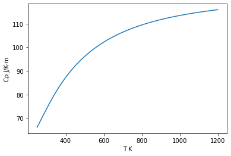

How to import a coder generated module into ThermoEngine
========================================================

Demonstrates importing both stoichiometric and solution phase modules
---------------------------------------------------------------------

import ThermoEngine libraries …

.. code:: ipython3

    from thermoengine import core, model, phases
    import numpy as np

This notebook tests functionality of objective-C modules and *coder*
generated modules for a pure phase (“Potassium Feldspar”, “Or”) and a
solution phase (“Feldspar”, “Fsp”). Examples of producing suitable
*coder* generated modules may be found in the notebooks: -
Example-1-Berman-std-state - Example-7-Simple-Solution

If *coder* generated modules are tested, the code files produced by the
*coder* module must be contained in the folder *working* located in the
same directory as this notebook. This folder must also house the Cython
(module_name.pyx) and Distutil (module_name.pyxbld) files defining the
python interface to the module and the compilation/link instructions.

If you are testing *coder* derived modules with this notebook, ensure
that the **calibration flag** set below **matches that specified when
the working code was generated by the coder module**.

Options:
--------

**use_pure_phases** - True: Run tests on the stoichiometric phase
*Potassium_Feldspar* - False: Run tests on the solution phase *Feldspar*

.. code:: ipython3

    use_pure_phase = False

**use_coder_module** - True: Use phase modules generated by *coder*.
Files must be avaialble in the *working* folder. They can be produced by
running notebook *Example-1* (stoichiometric phase) or *Example-1* +
*Example-7* (that together produced code for a solution phase) - False:
Use phase modules derived from the Berman (1988) database

.. code:: ipython3

    use_coder_module = True

**calib** - True: Test code that implements parameter calibration
methods. If *coder* module code is used, then ensure that the *calib*
flag was set to *True* when that code was generated. - False: Test code
that does not implement the parameter calibration methods. See above.

.. code:: ipython3

    calib = True

Load the module into ThermoEngine:
----------------------------------

Initialize a model class using the options specified above and display
some information about the model implementation …

.. code:: ipython3

    if use_coder_module:
        %cd working
        from pyximport import install
        install()
        import Simple_Solution
        %cd ..
        modelDB = model.Database(database="CoderModule", calib=calib, 
                                 phase_tuple=('Simple_Solution', {
                                     'Fsp':['Feldspar','solution'],
                                     'Ab':['High_Albite','pure'],
                                     'An':['Anorthite','pure'],
                                     'Or':['Potassium_Feldspar','pure']
                                 }))
    else:
        modelDB = model.Database()
    
    if use_pure_phase:
        phase = modelDB.get_phase('Or')
    else:
        phase = modelDB.get_phase('Fsp')
    
    for phase_name, abbrv in zip(modelDB.phase_info.phase_name,modelDB.phase_info.abbrev):
        print ('Abbreviation: {0:<10s} Name: {1:<30s}'.format(abbrv, phase_name))

.. parsed-literal::

    /Users/ghiorso/Documents/ARCHIVE_XCODE/ThermoEngine/Notebooks/Codegen/working
    /Users/ghiorso/Documents/ARCHIVE_XCODE/ThermoEngine/Notebooks/Codegen
    Solution phase code generated by the coder module does not yet provide information on solution species. Species are proxied by components.
    Solution phase code generated by the coder module does not yet provide information on species properties. Species are proxied by components.
    Abbreviation: Fsp        Name: Feldspar                      
    Abbreviation: Ab         Name: High_Albite                   
    Abbreviation: An         Name: Anorthite                     
    Abbreviation: Or         Name: Potassium_Feldspar            

Obtain information about this module:
-------------------------------------

.. code:: ipython3

    if use_pure_phase:
        print (phase.props['phase_name'])
        print (phase.props['formula'][0])
        print (phase.props['molwt'][0])
    else:
        print (phase.props['phase_name'])
        print (phase.props['formula'])
        print (phase.props['molwt'])
        print (phase.props['abbrev'])
        print (phase.props['endmember_num'])
        print (phase.props['endmember_name'])

.. parsed-literal::

    Feldspar
    ['NaAlSi3O8' 'Al2CaSi2O8' 'KAlSi3O8']
    [262.22301 278.20928 278.33524]
    Fsp
    3
    ['High_Albite' 'Anorthite' 'Potassium_Feldspar']

For solutions, specify composition of the phase:
------------------------------------------------

.. code:: ipython3

    if use_pure_phase:
        moles_end = None
    else:
        mol_oxides = core.chem.format_mol_oxide_comp({'SiO2':67.27,'Al2O3':18.35, 'FeO':0.92, 'CaO':0.15, 
                                                      'Na2O':6.45, 'K2O':7.05, 'H2O':0.16}, convert_grams_to_moles=True)
        moles_end,oxide_res = phase.calc_endmember_comp(mol_oxide_comp=mol_oxides, method='intrinsic', output_residual=True)
        for i in range(0,phase.props['endmember_num']):
            print ("mole number of {0:10.10s} = {1:13.6e}".format(phase.props['endmember_name'][i], moles_end[i]))
        if not phase.test_endmember_comp(moles_end):
            print ("Calculated composition is infeasible!")
        print ('Formula: ', phase.compute_formula(1000.0, 1000.0, moles_end))
        print ('Total moles of endmembers: ', phase.covert_endmember_comp(moles_end,output='total_moles'))
        mol_elm = phase.covert_endmember_comp(moles_end,output='moles_elements')
        print ('Mole fractions of endmembers: ', phase.covert_endmember_comp(moles_end,output='mole_fraction'))
        print ('Moles of endmembers: ', phase.convert_elements(mol_elm, output='moles_end'))
        print ('Total moles of endmembers: ', phase.convert_elements(mol_elm, output='total_moles'))
        print ('Total grams of phase: ', phase.convert_elements(mol_elm, output='total_grams'))
        # Check if intrinsic mode fails
        if len(moles_end) == 0:
            print ('Intrinsic mode returned an empty array; estimating composition ...')
            moles_end = np.array([0.20813521, 0.00267478, 0.14968884])
            print (moles_end)

.. parsed-literal::

    mole number of High_Albit =  2.081352e-01
    mole number of Anorthite  =  2.674779e-03
    mole number of Potassium_ =  1.496888e-01
    Formula:  Ca0.007Na0.577K0.415Al1.007Si2.993O8
    Total moles of endmembers:  0.36049883224427715
    Mole fractions of endmembers:  [0.57735337 0.00741966 0.41522697]
    Moles of endmembers:  [0.20813521 0.00267478 0.14968884]
    Total moles of endmembers:  0.36049883224427715
    Total grams of phase:  96.98566962270826

All phases should implement the following functions:
----------------------------------------------------

where *T* (temperature) is in K, and *P* (pressure) is in bars. Note
that for stoichiometric phases, compositional derivatives are not
implemented. In addition, Some functions are only available in code
generated by the coder module. These functions return a scalar or an
(multi-dimensional) array, depending on input.

.. code:: ipython3

    def test_func(name, func, t, p, units, deriv=None, const=None, endmember=None):
        global moles_end
        try:
            if deriv:
                result = func(t, p, deriv=deriv, mol=moles_end)
                if type(result) is np.ndarray:
                    if len(result.shape) == 2:
                        print ("{0:>10s}".format(name), end=' ')
                        for x in result[0]:
                            print ("{0:15.6e}".format(x), end=' ')
                        print (" {0:<20s}".format(units))
                    elif len(result.shape) == 3:
                        for i in range(0,result.shape[1]):
                            print ("{0:>10s}".format(name), end=' ')
                            for x in result[0][i]:
                                print ("{0:15.6e}".format(x), end=' ')
                            print (" {0:<20s}".format(units))
                    elif len(result.shape) == 4:
                        for i in range(0,result.shape[1]):
                            for j in range(0,result.shape[2]):
                                print ("{0:>10s}".format(name), end=' ')
                                for x in result[0][i][j]:
                                    print ("{0:15.6e}".format(x), end=' ')
                                print (" {0:<20s}".format(units))
                    elif len(result.shape) == 1:
                        print ("{0:>10s}".format(name), end=' ')
                        for x in result:
                            print ("{0:15.6e}".format(x), end=' ')
                        print (" {0:<20s}".format(units))
                    else:
                        print ('A', result.shape)
                else:
                    print ("{0:>10s}{1:15.6e} {2:<20s}".format(name, result, units))
            elif const:
                print ("{0:>10s}{1:15.6e} {2:<20s}".format(name, func(t, p, const=const, mol=moles_end), units))
            else:
                result = func(t, p, mol=moles_end)
                if type(result) is np.ndarray:
                    if len(result.shape) == 2:
                        print ("{0:>10s}".format(name), end=' ')
                        for x in result[0]:
                            print ("{0:15.6e}".format(x), end=' ')
                        print (" {0:<20s}".format(units))
                    elif len(result.shape) == 1:
                        print ("{0:>10s}".format(name), end=' ')
                        for x in result:
                            print ("{0:15.6e}".format(x), end=' ')
                        print (" {0:<20s}".format(units))
                    else:
                        print ('B', len(result.shape))
                else:
                    print ("{0:>10s}{1:15.6e} {2:<20s}".format(name, result, units))
        except AttributeError:
            print ("{0:>10s} is not implemented".format(name))
    
    test_func('G',  phase.gibbs_energy, 1000.0, 1000.0, 'J/mol')
    test_func('dG/dT', phase.gibbs_energy, 1000.0, 1000.0, 'J/K-mol', deriv={'dT':1})
    test_func('dG/dP', phase.gibbs_energy, 1000.0, 1000.0, 'J/bar-mol', deriv={'dP':1})
    test_func('dG/dm', phase.gibbs_energy, 1000.0, 1000.0, 'J/mol^2', deriv={'dmol':1})
    
    test_func('d2G/dT2', phase.gibbs_energy, 1000.0, 1000.0, 'J/K^2-mol', deriv={'dT':2})
    test_func('d2G/dTdP', phase.gibbs_energy, 1000.0, 1000.0, 'J/K-bar-mol', deriv={'dT':1, 'dP':1})
    test_func('d2G/dTdm', phase.gibbs_energy, 1000.0, 1000.0, 'J/K-mol^2', deriv={'dT':1, 'dmol':1})
    test_func('d2G/dP2', phase.gibbs_energy, 1000.0, 1000.0, 'J/bar^2-mol', deriv={'dP':2})
    test_func('d2G/dPdm', phase.gibbs_energy, 1000.0, 1000.0, 'J/bar-mol^2', deriv={'dP':1, 'dmol':1})
    test_func('d2G/dm2', phase.gibbs_energy, 1000.0, 1000.0, 'J/mol^3', deriv={'dmol':2})
    
    test_func('d3G/dT3', phase.gibbs_energy, 1000.0, 1000.0, 'J/K^3-mol', deriv={'dT':3})
    test_func('d3G/dT2dP', phase.gibbs_energy, 1000.0, 1000.0, 'J/K^2-bar-mol', deriv={'dT':2, 'dP':1})
    test_func('d3G/dT2dm', phase.gibbs_energy, 1000.0, 1000.0, 'J/K^2-mol^2', deriv={'dT':2, 'dmol':1})
    test_func('d3G/dTdP2', phase.gibbs_energy, 1000.0, 1000.0, 'J/K-bar^2-mol', deriv={'dT':1, 'dP':2})
    test_func('d3G/dTdPdm', phase.gibbs_energy, 1000.0, 1000.0, 'J/K-bar-mol^2', deriv={'dT':1, 'dP':1, 'dmol':1})
    test_func('d3G/dTdm2', phase.gibbs_energy, 1000.0, 1000.0, 'J/K-mol^3', deriv={'dT':1, 'dmol':2})
    test_func('d3G/dP3', phase.gibbs_energy, 1000.0, 1000.0, 'J/bar^3-mol', deriv={'dP':3})
    test_func('d3G/dP2dm', phase.gibbs_energy, 1000.0, 1000.0, 'J/bar^2-mol^2', deriv={'dP':2, 'dmol':1})
    test_func('d3G/dPdm2', phase.gibbs_energy, 1000.0, 1000.0, 'J/bar-mol^3', deriv={'dP':1, 'dmol':2})
    test_func('d3G/dm3', phase.gibbs_energy, 1000.0, 1000.0, 'J/mol^4', deriv={'dmol':3})
    
    test_func('H', phase.enthalpy, 1000.0, 1000.0, 'J/mol')
    test_func('S', phase.entropy, 1000.0, 1000.0, 'J/K-mol')
    test_func('dS/dm', phase.entropy, 1000.0, 1000.0, 'J/K-mol^2', deriv={'dmol':1})
    test_func('d2S/dm2', phase.entropy, 1000.0, 1000.0, 'J/K-mol^3', deriv={'dmol':2})
    
    test_func('Cv', phase.heat_capacity, 1000.0, 1000.0, 'J/K-mol', const='V')
    test_func('Cp', phase.heat_capacity, 1000.0, 1000.0, 'J/K-mol')
    test_func('dCp/dT', phase.heat_capacity, 1000.0, 1000.0, 'J/-K^2-mol', deriv={'dT':1})
    test_func('dCp/dm', phase.heat_capacity, 1000.0, 1000.0, 'J/-K-mol^2', deriv={'dmol':1})
    
    test_func('rho', phase.density, 1000.0, 1000.0, 'gm/cc')
    test_func('alpha', phase.thermal_exp, 1000.0, 1000.0, '1/K')
    test_func('beta', phase.compressibility, 1000.0, 1000.0, '1/bar')
    test_func('K', phase.bulk_mod, 1000.0, 1000.0, '')
    test_func('Kp', phase.bulk_mod, 1000.0, 1000.0, '1/bar', deriv={'dP':1})
    
    test_func("V", phase.volume, 1000.0, 1000.0, 'J/bar-mol')
    test_func("dV/dT", phase.volume, 1000.0, 1000.0, 'J/bar-K-mol', deriv={'dT':1})
    test_func("dv/dP", phase.volume, 1000.0, 1000.0, 'J/bar^2-mol', deriv={'dP':1})
    test_func("dv/dm", phase.volume, 1000.0, 1000.0, 'J/bar-mol^2', deriv={'dP':1, 'dmol':1})
    test_func("d2V/dT2", phase.volume, 1000.0, 1000.0, 'J/bar-K^2-mol', deriv={'dT':2})
    test_func("d2V/dTdP", phase.volume, 1000.0, 1000.0, 'J/bar^2-K-mol', deriv={'dT':1, 'dP':1})
    test_func("d2V/dP2", phase.volume, 1000.0, 1000.0, 'J/bar^3-mol', deriv={'dP':2})
    test_func("d2V/dTdm", phase.volume, 1000.0, 1000.0, 'J/bar-K-mol^2', deriv={'dT':1, 'dmol':1})
    test_func("d2V/dPdm", phase.volume, 1000.0, 1000.0, 'J/bar^2-mol^2', deriv={'dP':1, 'dmol':1})
    test_func("d2V/dm2", phase.volume, 1000.0, 1000.0, 'J/bar-mol^3', deriv={'dmol':2})
    
    test_func('mu0', phase.chem_potential, 1000.0, 1000.0, 'J/mol')
    test_func('activity', phase.activity, 1000.0, 1000.0, '')
    test_func('da/dm', phase.activity, 1000.0, 1000.0, '1/mol', deriv={'dmol':1})

.. parsed-literal::

             G  -1.543800e+06 J/mol               
         dG/dT  -2.008262e+02 J/K-mol             
         dG/dP   3.877689e+00 J/bar-mol           
         dG/dm   -4.262225e+06   -4.561322e+06   -4.305465e+06  J/mol^2             
       d2G/dT2  -1.135029e-01 J/K^2-mol           
      d2G/dTdP   1.063956e-04 J/K-bar-mol         
      d2G/dTdm   -5.542934e+02   -5.673239e+02   -5.607681e+02  J/K-mol^2           
       d2G/dP2  -7.051354e-06 J/bar^2-mol         
      d2G/dPdm    1.037394e+01    9.663737e+00    1.130785e+01  J/bar-mol^2         
       d2G/dm2   -1.132920e+04   -1.190827e+05    1.788060e+04    2.948972e+06    1.128839e+05   -2.687923e+04  J/mol^3             
       d3G/dT3   9.820971e-05 J/K^3-mol           
     d3G/dT2dP   2.475906e-08 J/K^2-bar-mol       
     d3G/dT2dm   -3.103643e-01   -3.208837e-01   -3.209783e-01  J/K^2-mol^2         
     d3G/dTdP2   0.000000e+00 J/K-bar^2-mol       
    d3G/dTdPdm    3.105467e-04    1.693974e-04    2.759511e-04  J/K-bar-mol^2       
     d3G/dTdm2    3.693986e+01   -2.673410e+01   -5.088541e+01    3.057945e+03   -1.746970e+01    7.106591e+01  J/K-mol^3           
       d3G/dP3   0.000000e+00 J/bar^3-mol         
     d3G/dP2dm   -1.960841e-05   -1.281943e-05   -1.961311e-05  J/bar^2-mol^2       
     d3G/dPdm2   -7.037012e-01    6.741086e-01    9.664175e-01    4.505048e+00   -1.017816e+00   -1.325570e+00  J/bar-mol^3         
       d3G/dm3    5.123105e+04    6.283228e+05   -6.776787e+03    1.105060e+06   -9.786400e+04   -1.082802e+05   -1.161175e+09   -4.882569e+05   -6.093240e+05    3.410139e+05  J/mol^4             
             H  -1.342973e+06 J/mol               
             S   2.008262e+02 J/K-mol             
         dS/dm    5.542934e+02    5.673239e+02    5.607681e+02  J/K-mol^2           
       d2S/dm2   -3.693986e+01    2.673410e+01    5.088541e+01   -3.057945e+03    1.746970e+01   -7.106591e+01  J/K-mol^3           
            Cv   1.118975e+02 J/K-mol             
            Cp   1.135029e+02 J/K-mol             
        dCp/dT   1.529320e-02 J/-K^2-mol          
        dCp/dm    3.103643e-04    3.208837e-04    3.209783e-04  J/-K-mol^2          
           rho is not implemented
         alpha   2.743789e-05 1/K                 
          beta   1.818442e-06 1/bar               
             K   5.499212e+05                     
            Kp  -1.000000e+00 1/bar               
             V   3.877689e+00 J/bar-mol           
         dV/dT   1.063956e-04 J/bar-K-mol         
         dv/dP  -7.051354e-06 J/bar^2-mol         
         dv/dm   -1.960841e-05   -1.281943e-05   -1.961311e-05  J/bar-mol^2         
       d2V/dT2   2.475906e-08 J/bar-K^2-mol       
      d2V/dTdP   0.000000e+00 J/bar^2-K-mol       
       d2V/dP2   0.000000e+00 J/bar^3-mol         
      d2V/dTdm    3.105467e-04    1.693974e-04    2.759511e-04  J/bar-K-mol^2       
      d2V/dPdm   -1.960841e-05   -1.281943e-05   -1.961311e-05  J/bar^2-mol^2       
       d2V/dm2   -7.037012e-01    6.741086e-01    9.664175e-01    4.505048e+00   -1.017816e+00   -1.325570e+00  J/bar-mol^3         
           mu0   -4.305465e+06  J/mol               
      activity is not implemented
         da/dm is not implemented

Illustrate parameter calibration protocol methods:
--------------------------------------------------

Phase code must have been generated with the *calib* option set to
*True*.

.. code:: ipython3

    try:
        param_props = phase.param_props
        supports_calib = param_props['supports_calib']
        print ('This phase supports the Calibration protocol')
        nparam = param_props['param_num']
        print ('... there are', nparam, 'parameters')
        names = param_props['param_names']
        units = param_props['param_units']
        values = param_props['param0']
        t = 1000.0
        p = 1000.0
        for i in range (0, nparam):
            print ("Parameter {0:<15s} has value {1:15.6e}  {2:<20s}".format(names[i], values[i], units[i]))
    except AttributeError:
        print ('This phase does not implement the parameter calibration protocol')

.. parsed-literal::

    This phase supports the Calibration protocol
    ... there are 23 parameters
    Parameter T_r             has value    2.981500e+02  K                   
    Parameter P_r             has value    1.000000e+00  bar                 
    Parameter Wh12            has value    7.924000e+03  J/m                 
    Parameter Ws12            has value    0.000000e+00  J/K-m               
    Parameter Wv12            has value    0.000000e+00  J/bar-m             
    Parameter dWh12           has value   -7.924000e+03  J/m                 
    Parameter dWs12           has value    0.000000e+00  J/K-m               
    Parameter dWv12           has value    0.000000e+00  J/bar-m             
    Parameter Wh13            has value    4.613000e+04  J/m                 
    Parameter Ws13            has value    2.060000e+01  J/K-m               
    Parameter Wv13            has value    7.866000e-01  J/bar-m             
    Parameter dWh13           has value    8.510000e+03  J/m                 
    Parameter dWs13           has value    0.000000e+00  J/K-m               
    Parameter dWv13           has value   -1.338000e-01  J/bar-m             
    Parameter Wh23            has value    7.929100e+04  J/m                 
    Parameter Ws23            has value    0.000000e+00  J/K-m               
    Parameter Wv23            has value   -1.037000e-01  J/bar-m             
    Parameter dWh23           has value    1.343000e+03  J/m                 
    Parameter dWs23           has value    0.000000e+00  J/K-m               
    Parameter dWv23           has value    1.037000e-01  J/bar-m             
    Parameter Wh123           has value    1.254500e+04  J/m                 
    Parameter Ws123           has value    0.000000e+00  J/K-m               
    Parameter Wv123           has value   -1.095000e+00  J/bar-m             

Calculate parameter derivative methods:
---------------------------------------

Phase code must have been generated with the *calib* option set to
*True*.

The variable *deriv_param* in the following code block may be set to: -
an integer, identifying the element in the parameter array that is
output above - a string, identifying the parameter itself - a list of
integers, i.e. [4, 6], identifying a set of parameter derivatives, which
will generate an output array - a list of strings, identifying
parameters whose derivatives are output as an array

.. code:: ipython3

    if phase.calib:
        deriv_param = 4
        print ("Derivatives with respect to parameter:", names[deriv_param])
        def test_func(name, func, t, p, units, deriv=None):
            global moles_end, deriv_param
            name = 'd('+name+')/dParam'
            try:
                result = func(t, p, mol=moles_end, deriv=deriv, deriv_param=deriv_param)
                if type(result) is np.ndarray:
                    if len(result.shape) == 2:
                        print ("{0:>20s}".format(name), end=' ')
                        for x in result[0]:
                            print ("{0:15.6e}".format(x), end=' ')
                        print (" {0:<20s}".format(units))
                    elif len(result.shape) == 1:
                        print ("{0:>10s}".format(name), end=' ')
                        for x in result:
                            print ("{0:15.6e}".format(x), end=' ')
                        print (" {0:<20s}".format(units))
                    else:
                        print ('B', len(result.shape))
                else:
                    print ("{0:>20s}{1:15.6e} {2:<20s}".format(name, result, units))
            except AttributeError:
                print ("{0:>20s}{1:>15s}".format(name, "NYI"))
        test_func('G', phase.gibbs_energy, 1000.0, 1000.0, 'J')
        test_func('dG/dT', phase.gibbs_energy, 1000.0, 1000.0, 'J/K-mol', deriv={'dT':1})
        test_func('dG/dP', phase.gibbs_energy, 1000.0, 1000.0, 'J/bar-mol', deriv={'dP':1})
        test_func('dG/dm', phase.gibbs_energy, 1000.0, 1000.0, 'J/mol^2', deriv={'dmol':1})
    
        test_func('d2G/dT2', phase.gibbs_energy, 1000.0, 1000.0, 'J/K^2-mol', deriv={'dT':2})
        test_func('d2G/dTdP', phase.gibbs_energy, 1000.0, 1000.0, 'J/K-bar-mol', deriv={'dT':1, 'dP':1})
        test_func('d2G/dTdm', phase.gibbs_energy, 1000.0, 1000.0, 'J/K-mol^2', deriv={'dT':1, 'dmol':1})
        test_func('d2G/dP2', phase.gibbs_energy, 1000.0, 1000.0, 'J/bar^2-mol', deriv={'dP':2})
        test_func('d2G/dPdm', phase.gibbs_energy, 1000.0, 1000.0, 'J/bar-mol^2', deriv={'dP':1, 'dmol':1})
        test_func('d2G/dm2', phase.gibbs_energy, 1000.0, 1000.0, 'J/mol^3', deriv={'dmol':2})
    
        test_func('d3G/dT3', phase.gibbs_energy, 1000.0, 1000.0, 'J/K^3-mol', deriv={'dT':3})
        test_func('d3G/dT2dP', phase.gibbs_energy, 1000.0, 1000.0, 'J/K^2-bar-mol', deriv={'dT':2, 'dP':1})
        test_func('d3G/dT2dm', phase.gibbs_energy, 1000.0, 1000.0, 'J/K^2-mol^2', deriv={'dT':2, 'dmol':1})
        test_func('d3G/dTdP2', phase.gibbs_energy, 1000.0, 1000.0, 'J/K-bar^2-mol', deriv={'dT':1, 'dP':2})
        test_func('d3G/dTdPdm', phase.gibbs_energy, 1000.0, 1000.0, 'J/K-bar-mol^2', deriv={'dT':1, 'dP':1, 'dmol':1})
        test_func('d3G/dTdm2', phase.gibbs_energy, 1000.0, 1000.0, 'J/K-mol^3', deriv={'dT':1, 'dmol':2})
        test_func('d3G/dP3', phase.gibbs_energy, 1000.0, 1000.0, 'J/bar^3-mol', deriv={'dP':3})
        test_func('d3G/dP2dm', phase.gibbs_energy, 1000.0, 1000.0, 'J/bar^2-mol^2', deriv={'dP':2, 'dmol':1})
        test_func('d3G/dPdm2', phase.gibbs_energy, 1000.0, 1000.0, 'J/bar-mol^3', deriv={'dP':1, 'dmol':2})
        test_func('d3G/dm3', phase.gibbs_energy, 1000.0, 1000.0, 'J/mol^4', deriv={'dmol':3})

.. parsed-literal::

    Derivatives with respect to parameter: Wv12
             d(G)/dParam   1.544293e+00 J                   
         d(dG/dT)/dParam   0.000000e+00 J/K-mol             
         d(dG/dP)/dParam   1.544293e-03 J/bar-mol           
         d(dG/dm)/dParam    3.135895e+00    5.730696e+02   -4.283766e+00  J/mol^2             
       d(d2G/dT2)/dParam   0.000000e+00 J/K^2-mol           
      d(d2G/dTdP)/dParam   0.000000e+00 J/K-bar-mol         
      d(d2G/dTdm)/dParam            NYI
       d(d2G/dP2)/dParam   0.000000e+00 J/bar^2-mol         
      d(d2G/dPdm)/dParam            NYI
       d(d2G/dm2)/dParam            NYI
       d(d3G/dT3)/dParam   0.000000e+00 J/K^3-mol           
     d(d3G/dT2dP)/dParam   0.000000e+00 J/K^2-bar-mol       
     d(d3G/dT2dm)/dParam            NYI
     d(d3G/dTdP2)/dParam   0.000000e+00 J/K-bar^2-mol       
    d(d3G/dTdPdm)/dParam            NYI
     d(d3G/dTdm2)/dParam            NYI
       d(d3G/dP3)/dParam   0.000000e+00 J/bar^3-mol         
     d(d3G/dP2dm)/dParam            NYI
     d(d3G/dPdm2)/dParam            NYI
       d(d3G/dm3)/dParam            NYI

Illustrate plotting the heat capacity using an input array of temperatures:
---------------------------------------------------------------------------

| `Documentation on PyPlot in
  MatPlotLib <https://matplotlib.org/users/pyplot_tutorial.html>`__
| Pressure is fixed at 1000 bars.

.. code:: ipython3

    import matplotlib.pyplot as plt
    import numpy as np
    %matplotlib inline
    T_array = np.linspace(250.0, 1200.0, 100, endpoint=True)
    Cp_array = phase.heat_capacity(T_array, 1000.0, mol=moles_end)
    plt.plot(T_array, Cp_array)
    plt.ylabel('Cp J/K-m')
    plt.xlabel('T K')
    plt.show()

