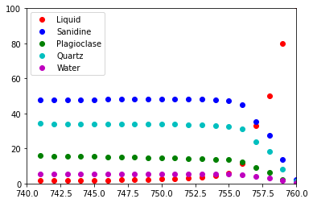

MELTS
=====

| Versions of MELTS implemented are:
| - MELTS v. 1.0.2 ➞ (rhyolite-MELTS, Gualda et al., 2012)
| - MELTS v. 1.1.0 ➞ (rhyolite-MELTS + new CO2, works at the ternary
  minimum)
| - MELTS v. 1.2.0 ➞ (rhyolite-MELTS + new H2O + new CO2)
| - pMELTS v. 5.6.1

Initialize tools and packages that are required to execute this notebook.
-------------------------------------------------------------------------

.. code:: ipython3

    from thermoengine import equilibrate
    import matplotlib.pyplot as plt
    import numpy as np
    %matplotlib inline

Create a MELTS v 1.0.2 instance.
--------------------------------

Rhyolite-MELTS version 1.0.2 is the default model.

.. code:: ipython3

    melts = equilibrate.MELTSmodel()

Optional: Generate some information about the implemented model.
~~~~~~~~~~~~~~~~~~~~~~~~~~~~~~~~~~~~~~~~~~~~~~~~~~~~~~~~~~~~~~~~

.. code:: ipython3

    oxides = melts.get_oxide_names()
    phases = melts.get_phase_names()
    #print (oxides)
    #print (phases)

Required: Input initial composition of the system (liquid), in wt% or grams of oxides.
--------------------------------------------------------------------------------------

Early Bishop Tuff average melt inlusion composition

.. code:: ipython3

    feasible = melts.set_bulk_composition({'SiO2':  77.5, 
                                           'TiO2':   0.08, 
                                           'Al2O3': 12.5, 
                                           'Fe2O3':  0.207,
                                           'Cr2O3':  0.0, 
                                           'FeO':    0.473, 
                                           'MnO':    0.0,
                                           'MgO':    0.03, 
                                           'NiO':    0.0, 
                                           'CoO':    0.0,
                                           'CaO':    0.43, 
                                           'Na2O':   3.98, 
                                           'K2O':    4.88, 
                                           'P2O5':   0.0, 
                                           'H2O':    5.5})

Optional: Suppress phases that are not required in the simulation.
------------------------------------------------------------------

.. code:: ipython3

    b = melts.get_phase_inclusion_status()
    melts.set_phase_inclusion_status({'Nepheline':False, 'OrthoOxide':False})
    a = melts.get_phase_inclusion_status()
    for phase in b.keys():
        if b[phase] != a[phase]:
            print ("{0:<15s} Before: {1:<5s} After: {2:<5s}".format(phase, repr(b[phase]), repr(a[phase])))

.. parsed-literal::

    Nepheline       Before: True  After: False
    OrthoOxide      Before: True  After: False

Compute the equilibrium state at some specified T (°C) and P (MPa).
-------------------------------------------------------------------

Print status of the calculation.

.. code:: ipython3

    output = melts.equilibrate_tp(760.0, 175.0, initialize=True)
    (status, t, p, xmlout) = output[0]
    print (status, t, p)

.. parsed-literal::

    success, Minimal energy computed. 760.0 175.0

Summary output of equilibrium state …
~~~~~~~~~~~~~~~~~~~~~~~~~~~~~~~~~~~~~

.. code:: ipython3

    melts.output_summary(xmlout)

.. parsed-literal::

    T (°C)       760.00
    P (MPa)      175.00
    Quartz            1.2006 (g)  SiO2                                                        
    Liquid          101.5218 (g)  wt %:SiO2 73.63 TiO2  0.08 Al2O3 11.87 Fe2O3  0.20 Cr2O3  0.00 FeO  0.47 MnO  0.00 MgO 
                                      0.03 NiO  0.00 CoO  0.00 CaO  0.42 Na2O  3.79 K2O  4.61 P2O5  0.00 H2O  4.90
    Sanidine          2.3292 (g)  K0.49Na0.50Ca0.01Al1.01Si2.99O8                             
    Water             0.5285 (g)  H2O                                                         

Output thermodynamic properties of any phase present in the system
~~~~~~~~~~~~~~~~~~~~~~~~~~~~~~~~~~~~~~~~~~~~~~~~~~~~~~~~~~~~~~~~~~

… or the sum of all phases in the system

.. code:: ipython3

    props = melts.get_list_of_properties()
    for prop in props:
        print ("{0:<20s} {1:13.6e} {2:<10s}".format(prop, melts.get_property_of_phase(xmlout,'System', prop), \
                                                    melts.get_units_of_property(prop)))

.. parsed-literal::

    Mass                  1.055800e+02 g         
    GibbsFreeEnergy      -1.723511e+06 J         
    Enthalpy             -1.444769e+06 J         
    Entropy               2.697990e+02 J/K       
    HeatCapacity          1.419994e+02 J/K       
    DcpDt                 1.086318e-02 J/K^2     
    Volume                4.885928e+00 J/bar     
    DvDt                  8.637431e-04 J/bar-K   
    DvDp                 -1.354787e-04 J/bar^2   
    D2vDt2                3.084601e-07 J/bar-K^2 
    D2vDtDp              -2.083152e-07 J/bar^2-K 
    D2vDp2                8.811872e-08 J/bar^3   
    Density               2.160900e+00 g/cm^3    
    Alpha                 1.767818e-04 1/K       
    Beta                  2.772834e-05 1/bar     
    K                     3.606418e+00 GPa       
    K'                    2.245704e+01 none      
    Gamma                 4.677198e-02 none      

Output chemical affinities and potential compositions of undersaturated phases
~~~~~~~~~~~~~~~~~~~~~~~~~~~~~~~~~~~~~~~~~~~~~~~~~~~~~~~~~~~~~~~~~~~~~~~~~~~~~~

.. code:: ipython3

    dict = melts.get_dictionary_of_affinities(xmlout, sort=True)
    for phase in dict:
        (affinity, formulae) = dict[phase]
        print ("{0:<20s} {1:10.2f} {2:<60s}".format(phase, affinity, formulae))

.. parsed-literal::

    Leucite                 1843.53 K0.50Na0.50AlSi2O5.50(OH)1.00                               
    Tridymite               2141.04 SiO2                                                        
    Cristobalite            2204.71 SiO2                                                        
    Spinel                  3443.41 Fe''1.00Mg0.00Fe'''0.00Al1.00Cr1.00Ti0.00O4                 
    Magnetite               6100.91 Fe3O4                                                       
    Coesite                 6702.07 SiO2                                                        
    Ilmenite ss             7040.63 Mn0.00Fe''0.00Mg0.50Fe'''1.00Al0.00Ti0.50O3                 
    Orthopyroxene           7481.78 Na0.00Ca0.50Fe''0.00Mg1.50Fe'''0.00Ti0.00Al0.00Si2.00O6     
    Pigeonite               7899.03 Na0.00Ca0.50Fe''0.00Mg1.50Fe'''0.00Ti0.00Al0.00Si2.00O6     
    Olivine                 8602.61 (Ca0.00Mg0.00Fe''0.50Mn0.50Co0.00Ni0.00)2SiO4               
    Fayalite               10535.94 Fe2SiO4                                                     
    Ilmenite               10912.99 FeTiO3                                                      
    Rutile                 13232.93 TiO2                                                        
    Sillimanite            14224.20 Al2SiO5                                                     
    Andalusite             14583.54 Al2SiO5                                                     
    Corundum               14605.08 Al2O3                                                       
    Kyanite                18244.50 Al2SiO5                                                     
    Garnet                 18772.08 (Ca0.50Fe''0.50Mg0.00)3Al2Si3O12                            
    Hematite               18830.66 Fe2O3                                                       
    Biotite                19819.30 K(Fe''0.50Mg0.50)3AlSi3O10(OH)2                             
    Nepheline              20015.65 NaAlSiO4                                                    
    Sphene                 24104.31 CaTiSiO5                                                    
    Muscovite              25188.37 KAl2Si3AlO10(OH)2                                           
    Phlogopite             28723.51 KMg3AlSi3O10(OH)2                                           
    Forsterite             29210.52 Mg2SiO4                                                     
    OrthoOxide             29553.98 Fe''0.50Mg0.00Fe'''1.00Ti1.50O5                             
    Kalsilite              33671.36 KAlSiO4                                                     
    Cummingtonite          37212.14 Ca0.00Fe0.00Mg7.00Si8O22(OH)2                               
    Perovskite             38528.62 CaTiO3                                                      
    Anthophyllite          39317.80 Ca0.00Fe0.00Mg7.00Si8O22(OH)2                               
    Periclase              43143.46 MgO                                                         
    Nepheline ss           43681.21 Na2.00K2.00Ca0.00[]0.00Al4.00Si4.00O16                      
    Melilite               48421.67 Na0.00Ca2.00Al2.00Mg-0.00Fe0.00Si1.00O7                     
    Kalsilite ss           51793.54 Na2.00K2.00Ca0.00[]0.00Al4.00Si4.00O16                      
    Hornblende             54565.30 NaCa2Mg2.00Fe2+2.00Al1.00Fe3+0.00Al2Si6O22(OH)2             
    Aenigmatite            58029.65 Na2Fe5TiSi6O20                                              
    Solid Alloy            69174.78 Fe1.00Ni0.00                                                
    Liquid Alloy           73771.78 Fe1.00Ni0.00                                                
    Akermanite             80666.47 Ca2MgSi2O7                                                  
    Gehlenite              84296.04 Ca2Al2SiO7                                                  
    Lime                  113534.98 CaO                                                         
    Aegirine              141581.81 NaFeSi2O6                                                   
    Actinolite            999999.00 Ca0.00Fe3.50Mg3.50Si8O22(OH)2                               
    Whitlockite           999999.00 Ca3(PO4)2                                                   
    Apatite               999999.00 Ca5(PO4)3OH                                                 
    Chromite              999999.00 FeCr2O4                                                     
    Plagioclase           999999.00 K0.00Na0.50Ca0.50Al1.50Si2.50O8                             
    Augite                999999.00 Na0.00Ca0.50Fe''0.00Mg1.50Fe'''0.00Ti0.00Al0.00Si2.00O6     
    Titanaugite           999999.00 Na0.00Ca0.50Fe''0.00Mg1.50Fe'''0.00Ti0.00Al0.00Si2.00O6     
    Panunzite             999999.00 Na2.00K2.00Ca0.00[]0.00Al4.00Si4.00O16                      

Run the sequence of calculations along a T, P=constant path:
------------------------------------------------------------

Output is sent to an Excel file and plotted in the notebook

.. code:: ipython3

    number_of_steps = 20
    t_increment_of_steps = -1.0
    p_increment_of_steps = 0.0
    
    plotPhases = ['Liquid', 'Sanidine', 'Plagioclase', 'Quartz', 'Water']
    # matplotlib colors b : blue, g : green, r : red, c : cyan, m : magenta, y : yellow, k : black, w : white.
    plotColors = [ 'ro', 'bo', 'go', 'co', 'mo']
    
    wb = melts.start_excel_workbook_with_sheet_name(sheetName="Summary")
    melts.update_excel_workbook(wb, xmlout)
    
    n = len(plotPhases)
    xPlot = np.zeros(number_of_steps+1)
    yPlot = np.zeros((n, number_of_steps+1))
    xPlot[0] = t
    for i in range (0, n):
        yPlot[i][0] = melts.get_property_of_phase(xmlout, plotPhases[i])
    
    plt.ion()
    fig = plt.figure()
    ax = fig.add_subplot(111)
    ax.set_xlim([min(t, t+t_increment_of_steps*number_of_steps), max(t, t+t_increment_of_steps*number_of_steps)])
    ax.set_ylim([0., 100.])
    graphs = []
    for i in range (0, n):
        graphs.append(ax.plot(xPlot, yPlot[i], plotColors[i]))
    handle = []
    for (graph,) in graphs:
        handle.append(graph)
    ax.legend(handle, plotPhases, loc='upper left')
    
    for i in range (1, number_of_steps):
        output = melts.equilibrate_tp(t+t_increment_of_steps, p+p_increment_of_steps)
        (status, t, p, xmlout) = output[0]
        print ("{0:<30s} {1:8.2f} {2:8.2f}".format(status, t, p))
        xPlot[i] = t
        for j in range (0, n):
            yPlot[j][i] = melts.get_property_of_phase(xmlout, plotPhases[j])
        j = 0
        for (graph,) in graphs:
            graph.set_xdata(xPlot)
            graph.set_ydata(yPlot[j])
            j = j + 1
        fig.canvas.draw()
        melts.update_excel_workbook(wb, xmlout)
    
    melts.write_excel_workbook(wb, "MELTSv102summary.xlsx")

.. parsed-literal::

    success, Minimal energy computed.   759.00   175.00
    success, Minimal energy computed.   758.00   175.00
    success, Minimal energy computed.   757.00   175.00
    success, Minimal energy computed.   756.00   175.00
    success, Minimal energy computed.   755.00   175.00
    success, Minimal energy computed.   754.00   175.00
    success, Minimal energy computed.   753.00   175.00
    success, Minimal energy computed.   752.00   175.00
    success, Minimal energy computed.   751.00   175.00
    success, Minimal energy computed.   750.00   175.00
    success, Minimal energy computed.   749.00   175.00
    success, Minimal energy computed.   748.00   175.00
    success, Minimal energy computed.   747.00   175.00
    success, Minimal energy computed.   746.00   175.00
    success, Minimal energy computed.   745.00   175.00
    success, Minimal energy computed.   744.00   175.00
    success, Minimal energy computed.   743.00   175.00
    success, Optimal residual norm.   742.00   175.00
    success, Minimal energy computed.   741.00   175.00

