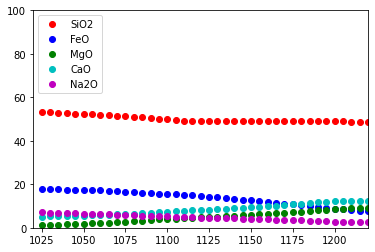

MELTS
=====

| Versions of MELTS implemented are:
| - MELTS v. 1.0.2 ➞ (rhyolite-MELTS, Gualda et al., 2012)
| - MELTS v. 1.1.0 ➞ (rhyolite-MELTS + new CO2, works at the ternary
  minimum)
| - MELTS v. 1.2.0 ➞ (rhyolite-MELTS + new H2O + new CO2)
| - pMELTS v. 5.6.1

Initialize tools and packages that are required to execute this notebook.
-------------------------------------------------------------------------

.. code:: ipython3

    from thermoengine import equilibrate
    import matplotlib.pyplot as plt
    import numpy as np
    %matplotlib inline

Create a MELTS v 1.0.2 instance.
--------------------------------

Rhyolite-MELTS version 1.0.2 is the default model.

.. code:: ipython3

    melts = equilibrate.MELTSmodel()

Optional: Generate some information about the implemented model.
~~~~~~~~~~~~~~~~~~~~~~~~~~~~~~~~~~~~~~~~~~~~~~~~~~~~~~~~~~~~~~~~

.. code:: ipython3

    oxides = melts.get_oxide_names()
    phases = melts.get_phase_names()
    #print (oxides)
    #print (phases)

Required: Input initial composition of the system (liquid), in wt% or grams of oxides.
--------------------------------------------------------------------------------------

Mid-Atlantic ridge MORB composition

.. code:: ipython3

    feasible = melts.set_bulk_composition({'SiO2':  48.68, 
                                           'TiO2':   1.01, 
                                           'Al2O3': 17.64, 
                                           'Fe2O3':  0.89,
                                           'Cr2O3':  0.0425, 
                                           'FeO':    7.59, 
                                           'MnO':    0.0,
                                           'MgO':    9.10, 
                                           'NiO':    0.0, 
                                           'CoO':    0.0,
                                           'CaO':   12.45, 
                                           'Na2O':   2.65, 
                                           'K2O':    0.03, 
                                           'P2O5':   0.08, 
                                           'H2O':    0.2})

Optional: Suppress phases that are not required in the simulation.
------------------------------------------------------------------

.. code:: ipython3

    b = melts.get_phase_inclusion_status()
    melts.set_phase_inclusion_status({'Nepheline':False, 'OrthoOxide':False})
    a = melts.get_phase_inclusion_status()
    for phase in b.keys():
        if b[phase] != a[phase]:
            print ("{0:<15s} Before: {1:<5s} After: {2:<5s}".format(phase, repr(b[phase]), repr(a[phase])))

.. parsed-literal::

    Nepheline       Before: True  After: False
    OrthoOxide      Before: True  After: False

Compute the equilibrium state at some specified T (°C) and P (MPa).
-------------------------------------------------------------------

Print status of the calculation.

.. code:: ipython3

    output = melts.equilibrate_tp(1220.0, 100.0, initialize=True)
    (status, t, p, xmlout) = output[0]
    print (status, t, p)

.. parsed-literal::

    success, Minimal energy computed. 1220.0 100.0

Summary output of equilibrium state …
~~~~~~~~~~~~~~~~~~~~~~~~~~~~~~~~~~~~~

.. code:: ipython3

    melts.output_summary(xmlout)
    dict = melts.get_dictionary_of_affinities(xmlout, sort=True)
    for phase in dict:
        (affinity, formulae) = dict[phase]
        if affinity < 10000.0:
            print ("{0:<20s} {1:10.2f} {2:<60s}".format(phase, affinity, formulae))

.. parsed-literal::

    T (°C)      1220.00
    P (MPa)      100.00
    Plagioclase       1.4715 (g)  K0.00Na0.19Ca0.81Al1.81Si2.19O8                             
    Spinel            0.0215 (g)  Fe''0.23Mg0.79Fe'''0.20Al1.32Cr0.45Ti0.02O4                 
    Liquid           98.8695 (g)  wt %:SiO2 48.53 TiO2  1.02 Al2O3 17.33 Fe2O3  0.90 Cr2O3  0.04 FeO  7.67 MnO  0.00
                                      MgO  9.20 NiO  0.00 CoO  0.00 CaO 12.34 Na2O  2.65 K2O  0.03 P2O5  0.08 H2O 
    Olivine                  118.94 (Ca0.00Mg0.00Fe''0.50Mn0.50Co0.00Ni0.00)2SiO4               
    Augite                  1333.92 Na0.00Ca0.50Fe''0.00Mg1.50Fe'''0.00Ti0.00Al0.00Si2.00O6     
    Orthopyroxene           2294.69 Na0.00Ca0.50Fe''0.00Mg1.50Fe'''0.00Ti0.00Al0.00Si2.00O6     
    Forsterite              3494.95 Mg2SiO4                                                     
    Quartz                  9073.52 SiO2                                                        

Obtain default set of fractionation coefficients (retain liquids, fractionate solids and fluids)
~~~~~~~~~~~~~~~~~~~~~~~~~~~~~~~~~~~~~~~~~~~~~~~~~~~~~~~~~~~~~~~~~~~~~~~~~~~~~~~~~~~~~~~~~~~~~~~~

.. code:: ipython3

    frac_coeff = melts.get_dictionary_of_default_fractionation_coefficients()
    print (frac_coeff)

.. parsed-literal::

    {'Actinolite': 1.0, 'Aegirine': 1.0, 'Aenigmatite': 1.0, 'Akermanite': 1.0, 'Andalusite': 1.0, 'Anthophyllite': 1.0, 'Apatite': 1.0, 'Augite': 1.0, 'Biotite': 1.0, 'Chromite': 1.0, 'Coesite': 1.0, 'Corundum': 1.0, 'Cristobalite': 1.0, 'Cummingtonite': 1.0, 'Fayalite': 1.0, 'Forsterite': 1.0, 'Garnet': 1.0, 'Gehlenite': 1.0, 'Hematite': 1.0, 'Hornblende': 1.0, 'Ilmenite': 1.0, 'Ilmenite ss': 1.0, 'Kalsilite': 1.0, 'Kalsilite ss': 1.0, 'Kyanite': 1.0, 'Leucite': 1.0, 'Lime': 1.0, 'Liquid': 0.0, 'Liquid Alloy': 1.0, 'Magnetite': 1.0, 'Melilite': 1.0, 'Muscovite': 1.0, 'Nepheline': 1.0, 'Nepheline ss': 1.0, 'Olivine': 1.0, 'OrthoOxide': 1.0, 'Orthopyroxene': 1.0, 'Panunzite': 1.0, 'Periclase': 1.0, 'Perovskite': 1.0, 'Phlogopite': 1.0, 'Pigeonite': 1.0, 'Plagioclase': 1.0, 'Quartz': 1.0, 'Rutile': 1.0, 'Sanidine': 1.0, 'Sillimanite': 1.0, 'Solid Alloy': 1.0, 'Sphene': 1.0, 'Spinel': 1.0, 'Titanaugite': 1.0, 'Tridymite': 1.0, 'Water': 1.0, 'Whitlockite': 1.0}

Run the sequence of calculations along a T, P=constant path:
------------------------------------------------------------

Output is sent to an Excel file and plotted in the notebook

.. code:: ipython3

    number_of_steps = 40
    t_increment_of_steps = -5.0
    p_increment_of_steps = 0.0
    
    plotOxides = ['SiO2', 'FeO', 'MgO', 'CaO', 'Na2O']
    # matplotlib colors b : blue, g : green, r : red, c : cyan, m : magenta, y : yellow, k : black, w : white.
    plotColors = [ 'ro', 'bo', 'go', 'co', 'mo']
    
    wb = melts.start_excel_workbook_with_sheet_name(sheetName="Summary")
    melts.update_excel_workbook(wb, xmlout)
    
    n = len(plotOxides)
    xPlot = np.zeros(number_of_steps+1)
    yPlot = np.zeros((n, number_of_steps+1))
    xPlot[0] = t
    for i in range (0, n):
        oxides = melts.get_composition_of_phase(xmlout, 'Liquid')
        yPlot[i][0] = oxides[plotOxides[i]]
    
    plt.ion()
    fig = plt.figure()
    ax = fig.add_subplot(111)
    ax.set_xlim([min(t, t+t_increment_of_steps*number_of_steps), max(t, t+t_increment_of_steps*number_of_steps)])
    ax.set_ylim([0., 100.])
    graphs = []
    for i in range (0, n):
        graphs.append(ax.plot(xPlot, yPlot[i], plotColors[i]))
    handle = []
    for (graph,) in graphs:
        handle.append(graph)
    ax.legend(handle, plotOxides, loc='upper left')
    
    for i in range (1, number_of_steps):
        # fractionate phases
        frac_output = melts.fractionate_phases(xmlout, frac_coeff)
        output = melts.equilibrate_tp(t+t_increment_of_steps, p+p_increment_of_steps, initialize=True)
        (status, t, p, xmlout) = output[0]
        print ("{0:<30s} {1:8.2f} {2:8.2f}".format(status, t, p))
        xPlot[i] = t
        for j in range (0, n):
            oxides = melts.get_composition_of_phase(xmlout, 'Liquid')
            yPlot[j][i] = oxides[plotOxides[j]]
        j = 0
        for (graph,) in graphs:
            graph.set_xdata(xPlot)
            graph.set_ydata(yPlot[j])
            j = j + 1
        fig.canvas.draw()
        melts.update_excel_workbook(wb, xmlout)
    
    melts.write_excel_workbook(wb, "MELTSv102summary.xlsx")

.. parsed-literal::

    success, Minimal energy computed.  1215.00   100.00
    success, Optimal residual norm.  1210.00   100.00
    success, Minimal energy computed.  1205.00   100.00
    success, Optimal residual norm.  1200.00   100.00
    success, Minimal energy computed.  1195.00   100.00
    success, Minimal energy computed.  1190.00   100.00
    success, Optimal residual norm.  1185.00   100.00
    success, Optimal residual norm.  1180.00   100.00
    success, Optimal residual norm.  1175.00   100.00
    success, Optimal residual norm.  1170.00   100.00
    success, Optimal residual norm.  1165.00   100.00
    success, Optimal residual norm.  1160.00   100.00
    success, Optimal residual norm.  1155.00   100.00
    success, Optimal residual norm.  1150.00   100.00
    success, Optimal residual norm.  1145.00   100.00
    success, Optimal residual norm.  1140.00   100.00
    success, Optimal residual norm.  1135.00   100.00
    success, Optimal residual norm.  1130.00   100.00
    success, Optimal residual norm.  1125.00   100.00
    success, Optimal residual norm.  1120.00   100.00
    success, Optimal residual norm.  1115.00   100.00
    success, Optimal residual norm.  1110.00   100.00
    success, Optimal residual norm.  1105.00   100.00
    success, Minimal energy computed.  1100.00   100.00
    success, Trivial case with no quadratic search.  1095.00   100.00
    success, Optimal residual norm.  1090.00   100.00
    success, Optimal residual norm.  1085.00   100.00
    success, Optimal residual norm.  1080.00   100.00
    success, Optimal residual norm.  1075.00   100.00
    success, Optimal residual norm.  1070.00   100.00
    success, Optimal residual norm.  1065.00   100.00
    success, Optimal residual norm.  1060.00   100.00
    success, Optimal residual norm.  1055.00   100.00
    success, Optimal residual norm.  1050.00   100.00
    success, Optimal residual norm.  1045.00   100.00
    success, Optimal residual norm.  1040.00   100.00
    success, Optimal residual norm.  1035.00   100.00
    success, Optimal residual norm.  1030.00   100.00
    success, Optimal residual norm.  1025.00   100.00

