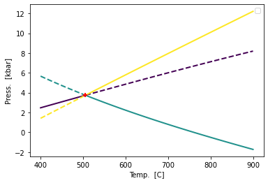

Phase Diagram Construction
==========================

Using the Berman(1988) database of pure solid phases (standard state properties)
~~~~~~~~~~~~~~~~~~~~~~~~~~~~~~~~~~~~~~~~~~~~~~~~~~~~~~~~~~~~~~~~~~~~~~~~~~~~~~~~

.. code:: ipython3

    import pandas as pd
    import numpy as np
    import matplotlib.pyplot as plt
    from thermoengine import phases
    from thermoengine import model
    %matplotlib inline

Create Thermodynamic Database
-----------------------------

.. code:: ipython3

    modelDB = model.Database()

Generate Reactions of Interest
------------------------------

.. code:: ipython3

    rxn_coef = [-1, +1]
    rxn_endmem = [0, 0]
    
    # Create reactions
    rxns = []
    rxns.append(modelDB.get_rxn(['And','Ky'], rxn_endmem, rxn_coef))
    rxns.append(modelDB.get_rxn(['And','Sil'], rxn_endmem, rxn_coef))
    rxns.append(modelDB.get_rxn(['Ky','Sil'], rxn_endmem, rxn_coef))
    
    # Create labels for legend
    rxn_eqns = []
    rxn_eqns.append('And = Ky')
    rxn_eqns.append('And = Sil')
    rxn_eqns.append('Ky = Sil')

.. parsed-literal::

    <string>:6: DeprecationWarning: Calling nonzero on 0d arrays is deprecated, as it behaves surprisingly. Use `atleast_1d(cond).nonzero()` if the old behavior was intended. If the context of this warning is of the form `arr[nonzero(cond)]`, just use `arr[cond]`.

Calculate Triple Point
----------------------

.. code:: ipython3

    # Calculate triple point
    T_tp, P_tp = rxns[0].simultaneous_rxn_cond(rxns[1])
    print(T_tp,P_tp)

.. parsed-literal::

    778.726955608905 3736.7184040516986

Plot Phase Diagram
------------------

.. code:: ipython3

    def get_nice_colors(Ncolor):
        cmap = plt.get_cmap(name='viridis')
        ind_a = np.int_(np.round(np.linspace(0,255,Ncolor)))
        colors = [cmap.colors[ind] for ind in ind_a]
        return colors

.. code:: ipython3

    colors = get_nice_colors(3)
    Tlims = 273.15 + np.array([400,900])
    
    rxn_bnds = []
    T_bnds = []
    P_bnds = []
    
    plt.figure()
    
    for irxn, col in zip(rxns, colors):
        iTbnds, iPbnds = irxn.trace_boundary(Tlims=Tlims, Nsamp=100)
        T_bnds.append(iTbnds)
        P_bnds.append(iPbnds)
        istable = irxn.stability(iTbnds, iPbnds, rxns)
        irxn_bnd, = plt.plot(iTbnds[istable]-273.15, iPbnds[istable]/1e3, '-',
                             lw=2, color=col)
        irxn_bnd_meta, = plt.plot(iTbnds[~istable]-273.15, iPbnds[~istable]/1e3, '--',
                             lw=2, color=col)
        
    plt.plot(T_tp-273.15, P_tp/1e3,'r+',mew=2)
    
    plt.xlabel('Temp.  [C]')
    plt.ylabel('Press.  [kbar]')
    
    plt.legend(rxn_bnds, rxn_eqns)

.. parsed-literal::

    <matplotlib.legend.Legend at 0x7fe8e1222e90>

