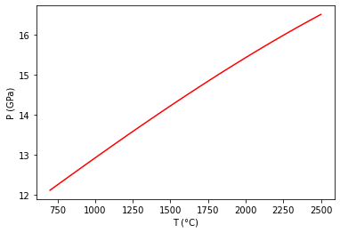

PhaseObjC - Plot a Reaction between Stoichiometric Phases
=========================================================

.. code:: ipython3

    from thermoengine import phases
    from thermoengine import model
    import numpy as np
    import matplotlib.pyplot as plt
    %matplotlib inline

Get access to a thermodynamic database (by default, the Berman (1988) database).
~~~~~~~~~~~~~~~~~~~~~~~~~~~~~~~~~~~~~~~~~~~~~~~~~~~~~~~~~~~~~~~~~~~~~~~~~~~~~~~~

.. code:: ipython3

    modelDBStix = model.Database('Stixrude')

To print a list of all of the phases in the database, execute:
~~~~~~~~~~~~~~~~~~~~~~~~~~~~~~~~~~~~~~~~~~~~~~~~~~~~~~~~~~~~~~

::

   print(thermoDB.all_purephases_df.to_string())

Specify a new reaction by indicating reactants, products.
~~~~~~~~~~~~~~~~~~~~~~~~~~~~~~~~~~~~~~~~~~~~~~~~~~~~~~~~~

forsterite = Mg-Wads

.. code:: ipython3

    reaction = modelDBStix.get_rxn(['Fo', 'MgWds'], [0, 0], [-1, 1])
    fo = modelDBStix.get_phase('Fo')
    wd = modelDBStix.get_phase('MgWds')

.. parsed-literal::

    <string>:6: DeprecationWarning: Calling nonzero on 0d arrays is deprecated, as it behaves surprisingly. Use `atleast_1d(cond).nonzero()` if the old behavior was intended. If the context of this warning is of the form `arr[nonzero(cond)]`, just use `arr[cond]`.

Check on the thermodynamic properties of the two phases close to a known
equilibrium point:

.. code:: ipython3

    p = 150000 # pressure in bars
    t = 2100 # temperature in Kelvins
    print(fo.gibbs_energy(t, p), wd.gibbs_energy(t, p))
    print(fo.enthalpy(t, p), wd.enthalpy(t, p))
    print(fo.entropy(t, p), wd.entropy(t, p))
    print(fo.volume(t, p), wd.volume(t, p))
    print(fo.heat_capacity(t, p), wd.heat_capacity(t, p))

.. parsed-literal::

    -1926419.5746241454 -1926366.384172494
    -1106691.3841051687 -1116548.7015712014
    390.34675738998897 385.6274679053774
    4.1087559308237935 3.9105580237791036
    180.7443249827713 183.95270593836193

Set up temperature bounds, and calculate the univariant curve.
~~~~~~~~~~~~~~~~~~~~~~~~~~~~~~~~~~~~~~~~~~~~~~~~~~~~~~~~~~~~~~

In this case convergence reqiuires specifying an initial guess for the
equilibrium T (in K)

.. code:: ipython3

    Tlims = 273.15+np.array([700,2500])
    univariant_line = reaction.trace_boundary(Tlims=Tlims,Nsamp=100)

Now, plot up the results.
~~~~~~~~~~~~~~~~~~~~~~~~~

.. code:: ipython3

    plt.plot (univariant_line[0]-273.15, univariant_line[1]/1e4, 'r-')
    plt.ylabel('P (GPa)')
    plt.xlabel('T (°C)')
    plt.show()

