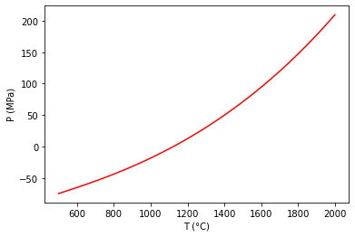

Plot a Reaction between Stoichiometric Phases
=============================================

.. code:: ipython3

    from thermoengine import phases
    from thermoengine import model
    import numpy as np
    import matplotlib.pyplot as plt
    %matplotlib inline

Get access to a thermodynamic database (by default, the Berman (1988) database).
~~~~~~~~~~~~~~~~~~~~~~~~~~~~~~~~~~~~~~~~~~~~~~~~~~~~~~~~~~~~~~~~~~~~~~~~~~~~~~~~

.. code:: ipython3

    modelDB = model.Database()

To print a list of all of the phases in the database, execute:
~~~~~~~~~~~~~~~~~~~~~~~~~~~~~~~~~~~~~~~~~~~~~~~~~~~~~~~~~~~~~~

::

   print(thermoDB.all_purephases_df.to_string())

Specify a new reaction by indicating reactants, products.
~~~~~~~~~~~~~~~~~~~~~~~~~~~~~~~~~~~~~~~~~~~~~~~~~~~~~~~~~

forsterite + quartz = 2 enstatite

.. code:: ipython3

    reaction = modelDB.get_rxn(['Fo','Qz','cEn'],[0,0,0],[-1,-1,2])

.. parsed-literal::

    <string>:6: DeprecationWarning: Calling nonzero on 0d arrays is deprecated, as it behaves surprisingly. Use `atleast_1d(cond).nonzero()` if the old behavior was intended. If the context of this warning is of the form `arr[nonzero(cond)]`, just use `arr[cond]`.

Set up temperature bounds, and calculate the univariant curve.
~~~~~~~~~~~~~~~~~~~~~~~~~~~~~~~~~~~~~~~~~~~~~~~~~~~~~~~~~~~~~~

.. code:: ipython3

    Tlims = 273.15+np.array([500,2000])
    univariant_line = reaction.trace_boundary(Tlims=Tlims,Nsamp=100)

Now, plot up the results.
~~~~~~~~~~~~~~~~~~~~~~~~~

.. code:: ipython3

    plt.plot (univariant_line[0]-273.15, univariant_line[1]/100.0, 'r-')
    plt.ylabel('P (MPa)')
    plt.xlabel('T (°C)')
    plt.show()

