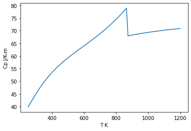

Quartz - Berman
===============

.. code:: ipython3

    from thermoengine import phases
    from thermoengine import model

Get access to a thermodynamic database (by default, the Berman (1988) database).
~~~~~~~~~~~~~~~~~~~~~~~~~~~~~~~~~~~~~~~~~~~~~~~~~~~~~~~~~~~~~~~~~~~~~~~~~~~~~~~~

.. code:: ipython3

    modelDB = model.Database()

Print a list of all of the phases in the database.
~~~~~~~~~~~~~~~~~~~~~~~~~~~~~~~~~~~~~~~~~~~~~~~~~~

.. code:: ipython3

    for phase_name, abbrv in zip(modelDB.phase_info.phase_name,modelDB.phase_info.abbrev):
        print ('Abbreviation: {0:<10s} Name: {1:<30s}'.format(abbrv, phase_name))

.. parsed-literal::

    Abbreviation: Bt         Name: Biotite                       
    Abbreviation: Cam        Name: Clinoamphibole                
    Abbreviation: Cpx        Name: Clinopyroxene                 
    Abbreviation: Fsp        Name: Feldspar                      
    Abbreviation: Grt        Name: Garnet                        
    Abbreviation: Hbl        Name: Hornblende                    
    Abbreviation: KlsS       Name: Kalsilite ss                  
    Abbreviation: LctS       Name: Leucite                       
    Abbreviation: Mll        Name: Melilite                      
    Abbreviation: NphS       Name: Feldspathoid                  
    Abbreviation: Ol         Name: Olivine                       
    Abbreviation: Opx        Name: Orthopyroxene                 
    Abbreviation: OrOx       Name: OrthoOxide                    
    Abbreviation: Oam        Name: Anthophyllite                 
    Abbreviation: Rhom       Name: Ilmenite ss                   
    Abbreviation: SplS       Name: Spinel                        
    Abbreviation: Liq        Name: Liquid                        
    Abbreviation: Aeg        Name: Aegirine                      
    Abbreviation: Aeng       Name: Aenigmatite                   
    Abbreviation: Ak         Name: Akermanite                    
    Abbreviation: And        Name: Andalusite                    
    Abbreviation: Ap         Name: Apatite                       
    Abbreviation: Chr        Name: Chromite                      
    Abbreviation: Coe        Name: Coesite                       
    Abbreviation: Crn        Name: Corundum                      
    Abbreviation: Crs        Name: Cristobalite                  
    Abbreviation: Fa         Name: Fayalite                      
    Abbreviation: Fo         Name: Forsterite                    
    Abbreviation: Gh         Name: Gehlenite                     
    Abbreviation: Hem        Name: Hematite                      
    Abbreviation: Ilm        Name: Ilmenite                      
    Abbreviation: Kls        Name: Kalsilite                     
    Abbreviation: Ky         Name: Kyanite                       
    Abbreviation: Lm         Name: Lime                          
    Abbreviation: Mag        Name: Magnetite                     
    Abbreviation: Ms         Name: Muscovite                     
    Abbreviation: Nph        Name: Nepheline                     
    Abbreviation: Per        Name: Periclase                     
    Abbreviation: Prv        Name: Perovskite                    
    Abbreviation: Phl        Name: Phlogopite                    
    Abbreviation: Qz         Name: Quartz                        
    Abbreviation: Rt         Name: Rutile                        
    Abbreviation: Sa         Name: sanidine                      
    Abbreviation: Sil        Name: Sillimanite                   
    Abbreviation: Spn        Name: Sphene                        
    Abbreviation: Trd        Name: Tridymite                     
    Abbreviation: Wht        Name: Whitlockite                   
    Abbreviation: Ab         Name: Albite                        
    Abbreviation: hAb        Name: High_Albite                   
    Abbreviation: lAb        Name: Low_Albite                    
    Abbreviation: Alm        Name: Almandine                     
    Abbreviation: An         Name: Anorthite                     
    Abbreviation: Ath        Name: Anthophyllite                 
    Abbreviation: Atg        Name: Antigorite                    
    Abbreviation: Brc        Name: Brucite                       
    Abbreviation: CaTs       Name: Ca-Al_Pyroxene                
    Abbreviation: Cal        Name: Calcite                       
    Abbreviation: Ctl        Name: Chrysotile                    
    Abbreviation: Clc        Name: Clinochlore                   
    Abbreviation: Crd        Name: Cordierite                    
    Abbreviation: Dsp        Name: Diaspore                      
    Abbreviation: Di         Name: Diopside                      
    Abbreviation: Dol        Name: Dolomite                      
    Abbreviation: cEn        Name: Clinoenstatite                
    Abbreviation: En         Name: Orthoenstatite                
    Abbreviation: pEn        Name: Protoenstatite                
    Abbreviation: Fs         Name: Ferrosilite                   
    Abbreviation: Grs        Name: Grossular                     
    Abbreviation: Jd         Name: Jadeite                       
    Abbreviation: Kln        Name: Kaolinite                     
    Abbreviation: Lws        Name: Lawsonite                     
    Abbreviation: Mgs        Name: Magnesite                     
    Abbreviation: Mei        Name: Meionite                      
    Abbreviation: Mw         Name: Merwinite                     
    Abbreviation: Mtc        Name: Monticellite                  
    Abbreviation: Pg         Name: Paragonite                    
    Abbreviation: Or         Name: Potassium_Feldspar            
    Abbreviation: Mc         Name: Microcline                    
    Abbreviation: Prh        Name: Prehnite                      
    Abbreviation: Prp        Name: Pyrope                        
    Abbreviation: Prl        Name: Pyrophyllite                  
    Abbreviation: Spl        Name: Mg_Al_Spinel                  
    Abbreviation: Tlc        Name: Talc                          
    Abbreviation: Tr         Name: Tremolite                     
    Abbreviation: Wo         Name: Wollastonite                  
    Abbreviation: pWo        Name: Pseudowollastonite            
    Abbreviation: Zo         Name: Zoisite                       
    Abbreviation: cZo        Name: Clinozoisite                  
    Abbreviation: O2         Name: Oxygen_Gas                    
    Abbreviation: S2         Name: Sulfur_Gas                    
    Abbreviation: H2         Name: Hydrogen_Gas                  
    Abbreviation: H2O        Name: Water                         

Create a Python reference to the ``Quartz`` stoichiometric phase class in the Berman (1988) database.
~~~~~~~~~~~~~~~~~~~~~~~~~~~~~~~~~~~~~~~~~~~~~~~~~~~~~~~~~~~~~~~~~~~~~~~~~~~~~~~~~~~~~~~~~~~~~~~~~~~~~

.. code:: ipython3

    Quartz = modelDB.get_phase('Qz')

Obtain information about this phase.
~~~~~~~~~~~~~~~~~~~~~~~~~~~~~~~~~~~~

.. code:: ipython3

    print (Quartz.props['phase_name'])
    print (Quartz.props['formula'][0])
    print (Quartz.props['molwt'][0])

.. parsed-literal::

    Quartz
    SiO2
    60.0843

All pure component (stoichiometric) phases implement the following functions:
~~~~~~~~~~~~~~~~~~~~~~~~~~~~~~~~~~~~~~~~~~~~~~~~~~~~~~~~~~~~~~~~~~~~~~~~~~~~~

::

   get_gibbs_energy(T, P)
   get_enthalpy(T, P)
   get_entropy(T, P)
   get_heat_capacity(T, P)
   get_dCp_dT(T, P)
   get_volume(T, P)
   get_dV_dT(T, P)
   get_dV_dP(T, P)
   get_d2V_dT2(T, P)
   get_d2V_dTdP(T, P)
   get_d2V_dP2(T, P)

where *T* (temperature) is in K, and *P* (pressure) is in bars. ###
These functions return a one-dimensional array:

.. code:: ipython3

    print ("{0:>10s}{1:15.2f}{2:<20s}".format("G", Quartz.gibbs_energy(1000.0, 1000.0), 'J/mol'))
    print ("{0:>10s}{1:15.2f}{2:<20s}".format("H", Quartz.enthalpy(1000.0, 1000.0), 'J/mol'))
    print ("{0:>10s}{1:15.2f}{2:<20s}".format("S", Quartz.entropy(1000.0, 1000.0), 'J/K-mol'))
    print ("{0:>10s}{1:15.3f}{2:<20s}".format("Cp", Quartz.heat_capacity(1000.0, 1000.0), 'J/K-mol'))
    print ("{0:>10s}{1:15.6e}{2:<20s}".format("dCp/dT", Quartz.heat_capacity(1000.0, 1000.0, deriv={'dT':1}), 'J/-K^2-mol'))
    print ("{0:>10s}{1:15.3f}{2:<20s}".format("V", Quartz.volume(1000.0, 1000.0, deriv={'dT':1}), 'J/bar-mol'))
    print ("{0:>10s}{1:15.6e}{2:<20s}".format("dV/dT", Quartz.volume(1000.0, 1000.0, deriv={'dT':1}), 'J/bar-K-mol'))
    print ("{0:>10s}{1:15.6e}{2:<20s}".format("dv/dP", Quartz.volume(1000.0, 1000.0, deriv={'dP':1}), 'J/bar^2-mol'))
    print ("{0:>10s}{1:15.6e}{2:<20s}".format("d2V/dT2", Quartz.volume(1000.0, 1000.0, deriv={'dT':2}), 'J/bar-K^2-mol'))
    print ("{0:>10s}{1:15.6e}{2:<20s}".format("d2V/dTdP", Quartz.volume(1000.0, 1000.0, deriv={'dT':1, 'dP':1}), 'J/bar^2-K-mol'))
    print ("{0:>10s}{1:15.6e}{2:<20s}".format("d2V/dP2", Quartz.volume(1000.0, 1000.0, deriv={'dP':2}), 'J/bar^3-mol'))

.. parsed-literal::

             G     -980365.07J/mol               
             H     -864126.03J/mol               
             S         116.24J/K-mol             
            Cp         69.356J/K-mol             
        dCp/dT   9.418167e-03J/-K^2-mol          
             V          0.000J/bar-mol           
         dV/dT   0.000000e+00J/bar-K-mol         
         dv/dP  -2.930704e-06J/bar^2-mol         
       d2V/dT2   0.000000e+00J/bar-K^2-mol       
      d2V/dTdP   0.000000e+00J/bar^2-K-mol       
       d2V/dP2   3.359238e-12J/bar^3-mol         

Illustrate the Parameter Calibration Protocol.
----------------------------------------------

.. code:: ipython3

    try:
        param_props = Quartz.param_props
        supports_calib = param_props['supports_calib']
        print ('This phase supports the Calibration protocol')
        nparam = param_props['param_num']
        print ('... there are', nparam, 'parameters')
        names = param_props['param_names']
        units = param_props['param_units']
        values = param_props['param0']
        t = 1000.0
        p = 1000.0
        for i in range (0, nparam):
            print ("Parameter {0:<15s} has value {1:15.6e}  {2:<20s}".format(names[i], values[i], units[i]))
    except AttributeError:
        print ('This phase does not implement the parameter calibration protocol')

.. parsed-literal::

    This phase supports the Calibration protocol
    ... there are 27 parameters
    Parameter delta H alpha   has value   -9.107000e+05  joules              
    Parameter S alpha         has value    4.146000e+01  joules/K            
    Parameter Cp k0 alpha     has value    8.001000e+01  joules/K            
    Parameter Cp k1 alpha     has value   -2.403000e+02  joules/K            
    Parameter Cp k2 alpha     has value   -3.546700e+06  joules/K            
    Parameter Cp k3 alpha     has value    4.915700e+08  joules/K            
    Parameter Cp l1 alpha     has value    0.000000e+00  joules/K            
    Parameter Cp l2 alpha     has value    0.000000e+00  joules/K            
    Parameter Cp Tt alpha     has value    0.000000e+00  K                   
    Parameter Cp Ht alpha     has value    0.000000e+00  joules              
    Parameter V alpha         has value    2.269000e+00  joules/bar          
    Parameter EOS v1 alpha    has value   -2.434000e-06  bar^-1              
    Parameter EOS v2 alpha    has value    1.013700e-11  bar^-2              
    Parameter EOS v3 alpha    has value    2.389500e-05  K^-1                
    Parameter EOS v4 alpha    has value    0.000000e+00  K^-2                
    Parameter delta H beta    has value   -9.086270e+05  joules              
    Parameter S beta          has value    4.420700e+01  joules/K            
    Parameter Cp k0 beta      has value    8.001000e+01  joules/K            
    Parameter Cp k1 beta      has value   -2.403000e+02  joules/K            
    Parameter Cp k2 beta      has value   -3.546700e+06  joules/K            
    Parameter Cp k3 beta      has value    4.915700e+08  joules/K            
    Parameter V beta          has value    2.370000e+00  joules/bar          
    Parameter EOS v1 beta     has value   -1.238000e-06  bar^-1              
    Parameter EOS v2 beta     has value    7.087000e-13  bar^-2              
    Parameter EOS v3 beta     has value    0.000000e+00  K^-1                
    Parameter EOS v4 beta     has value    0.000000e+00  K^-2                
    Parameter dTtdp           has value    2.370000e-02  K/bar               

Illustrate plotting the heat capacity.
--------------------------------------

| `Documentation on PyPlot in
  MatPlotLib <https://matplotlib.org/users/pyplot_tutorial.html>`__
| Pressure is fixed at 1000 bars.

.. code:: ipython3

    import matplotlib.pyplot as plt
    import numpy as np
    %matplotlib inline
    T_array = np.linspace(250.0, 1200.0, 100, endpoint=True)
    Cp_array = Quartz.heat_capacity(T_array, 1000.0)
    plt.plot(T_array, Cp_array)
    plt.ylabel('Cp J/K-m')
    plt.xlabel('T K')
    plt.show()

