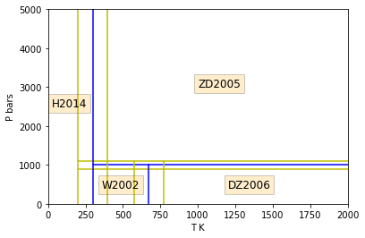
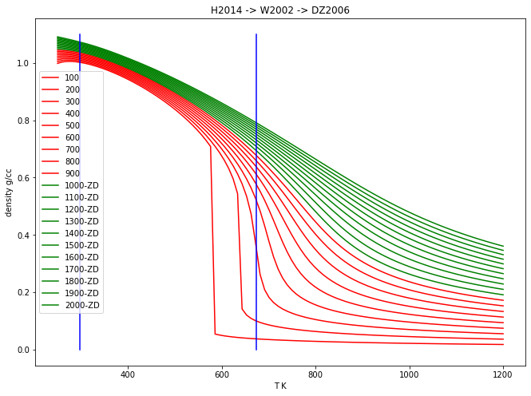
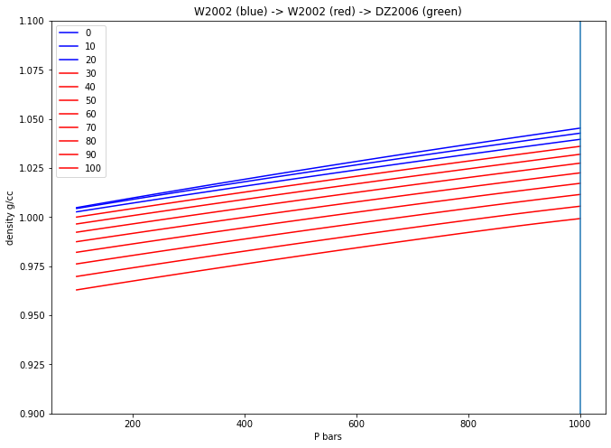
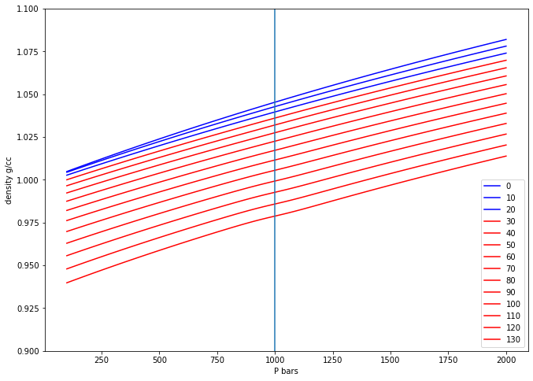
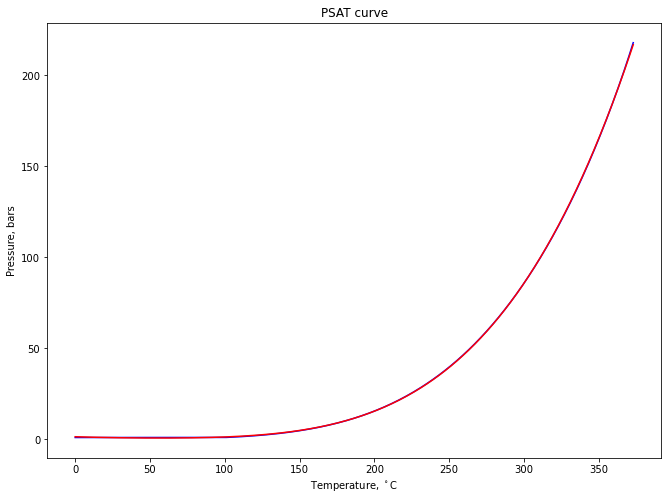
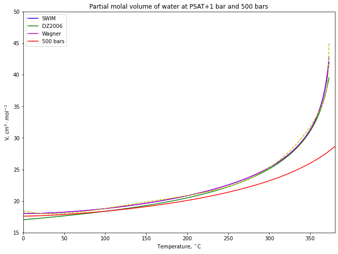

SWIM Example
============

Standard Water Integrated Model
-------------------------------

.. code:: ipython3

    from thermoengine import phases
    from thermoengine import model
    import matplotlib.pyplot as plt
    import numpy as np
    %matplotlib inline

| `Documentation for the GenericH2O
  class <https://gitlab.com/ENKI-portal/PhaseObjC/blob/master/Documentation/GenericH2O.md>`__
  Models:
| - H2014, Holten et al., 2014 - W2002, Wagner et al., 2002 - ZD2005,
  Zhang and Duan, 2005 - DZ2006, Duan and Zhang, 2006
| These models are merged, averaged and reconciled for all derivatives
  to third order over the following regions of :math:`T`-:math:`P`
  space.

.. code:: ipython3

    plt.plot([198.15,2000.0],[1100.0,1100.0],'y')
    plt.plot([198.15,2000.0],[ 900.0, 900.0],'y')
    plt.plot([298.15,2000.0],[1000.0,1000.0],'b')
    plt.plot([198.15,198.15],[0.0,5000.0],'y')
    plt.plot([398.15,398.15],[0.0,5000.0],'y')
    plt.plot([298.15,298.15],[0.0,5000.0],'b')
    plt.plot([573.15,573.15],[0.0,1100.0],'y')
    plt.plot([773.15,773.15],[0.0,1100.0],'y')
    plt.plot([673.15,673.15],[0.0,1000.0],'b')
    plt.ylabel('P bars')
    plt.xlabel('T K')
    plt.xlim(left=0.0, right=2000.0)
    plt.ylim(bottom=0.0, top=5000.0)
    plt.text(1000.0,3000.0,"ZD2005",fontsize=12,bbox=dict(facecolor='orange', alpha=0.2))
    plt.text(1200.0, 400.0,"DZ2006",fontsize=12,bbox=dict(facecolor='orange', alpha=0.2))
    plt.text( 360.0, 400.0,"W2002",fontsize=12,bbox=dict(facecolor='orange', alpha=0.2))
    plt.text(  25.0,2500.0,"H2014",fontsize=12,bbox=dict(facecolor='orange', alpha=0.2))
    plt.show()

Instantiate SWIM using the simple python wrappers
-------------------------------------------------

(Molecular weight in grams/mole)

.. code:: ipython3

    modelDB = model.Database()
    H2O = modelDB.get_phase('H2O')

.. code:: ipython3

    print (H2O.props['phase_name'])
    print (H2O.props['formula'][0])
    print (H2O.props['molwt'][0])

.. parsed-literal::

    Water
    H2O
    18.0152

Use the Python wrapper functions to obtain thermodynamic properties of water
----------------------------------------------------------------------------

:math:`T` (temperature, first argument) is in K, and :math:`P`
(pressure, second argument) is in bars.

.. code:: ipython3

    print ("{0:>10s}{1:15.2f}{2:<20s}".format("G", H2O.gibbs_energy(1000.0, 1000.0), 'J/mol'))
    print ("{0:>10s}{1:15.2f}{2:<20s}".format("H", H2O.enthalpy(1000.0, 1000.0), 'J/mol'))
    print ("{0:>10s}{1:15.2f}{2:<20s}".format("S", H2O.entropy(1000.0, 1000.0), 'J/K-mol'))
    print ("{0:>10s}{1:15.3f}{2:<20s}".format("Cp", H2O.heat_capacity(1000.0, 1000.0), 'J/K-mol'))
    print ("{0:>10s}{1:15.6e}{2:<20s}".format("dCp/dT", H2O.heat_capacity(1000.0, 1000.0, deriv={'dT':1}), 'J/-K^2-mol'))
    print ("{0:>10s}{1:15.3f}{2:<20s}".format("V", H2O.volume(1000.0, 1000.0, deriv={'dT':1}), 'J/bar-mol'))
    print ("{0:>10s}{1:15.6e}{2:<20s}".format("dV/dT", H2O.volume(1000.0, 1000.0, deriv={'dT':1}), 'J/bar-K-mol'))
    print ("{0:>10s}{1:15.6e}{2:<20s}".format("dv/dP", H2O.volume(1000.0, 1000.0, deriv={'dP':1}), 'J/bar^2-mol'))
    print ("{0:>10s}{1:15.6e}{2:<20s}".format("d2V/dT2", H2O.volume(1000.0, 1000.0, deriv={'dT':2}), 'J/bar-K^2-mol'))
    print ("{0:>10s}{1:15.6e}{2:<20s}".format("d2V/dTdP", H2O.volume(1000.0, 1000.0, deriv={'dT':1, 'dP':1}), 'J/bar^2-K-mol'))
    print ("{0:>10s}{1:15.6e}{2:<20s}".format("d2V/dP2", H2O.volume(1000.0, 1000.0, deriv={'dP':2}), 'J/bar^3-mol'))

.. parsed-literal::

             G     -323482.97J/mol               
             H     -225835.42J/mol               
             S         167.15J/K-mol             
            Cp         72.914J/K-mol             
        dCp/dT  -1.242746e-01J/-K^2-mol          
             V          0.014J/bar-mol           
         dV/dT   1.431826e-02J/bar-K-mol         
         dv/dP  -7.243395e-03J/bar^2-mol         
       d2V/dT2  -1.818046e-05J/bar-K^2-mol       
      d2V/dTdP  -1.299463e-05J/bar^2-K-mol       
       d2V/dP2   1.744388e-05J/bar^3-mol         

Plot the density of water as a function of :math:`T` …
------------------------------------------------------

… for 20 isobars at 100 to 2000 bars

.. code:: ipython3

    P_array = np.linspace(100.0, 2000.0, 20, endpoint=True) # 100->2000, 10 bars
    T_array = np.linspace(250.0, 1200.0, 100, endpoint=True) # 250->1200,100 K
    MW = H2O.props['molwt']
    for P in P_array:
        Den_array = MW/H2O.volume(T_array, P)/10.0 ## cc
        if P < 1000.0:
            plt.plot(T_array, Den_array, 'r-', label=str(int(P)))
        else:
            plt.plot(T_array, Den_array, 'g-', label=str(int(P))+"-ZD")
    plt.plot([673.15,673.15],[0.0,1.1],'b')
    plt.plot([298.15,298.15],[0.0,1.1],'b')
    plt.ylabel('density g/cc')
    plt.xlabel('T K')
    plt.title("H2014 -> W2002 -> DZ2006")
    plt.legend()
    fig = plt.gcf()
    fig.set_size_inches(11,8)
    plt.show()

Plot the density of water as a function of :math:`P` …
------------------------------------------------------

… for 11 isotherms at 0 to 100 °C

.. code:: ipython3

    T_array = np.linspace(0.0, 100.0, 11, endpoint=True) # 0->100, 11 °C
    P_array = np.linspace(100.0, 1000.0, 100, endpoint=True) # 100->1000, 100 bars
    MW = H2O.props['molwt']
    for T in T_array:
        Den_array = MW/H2O.volume(T+273.15, P_array)/10.0 ## cc
        if T <= 25.0:
            plt.plot(P_array, Den_array, 'b-', label=str(int(T)))
        elif T <= 400.0:
            plt.plot(P_array, Den_array, 'r-', label=str(int(T)))
        else:
            plt.plot(P_array, Den_array, 'g-', label=str(int(T)))
    plt.plot([1000.0,1000.0],[0.9,1.3])
    plt.ylabel('density g/cc')
    plt.xlabel('P bars')
    plt.ylim(bottom=0.9, top=1.1)
    plt.title("W2002 (blue) -> W2002 (red) -> DZ2006 (green)")
    plt.legend()
    fig = plt.gcf()
    fig.set_size_inches(11,8)
    plt.show()

Use direct calls to Objective-C functions (via Rubicon) to select specific water models
---------------------------------------------------------------------------------------

.. code:: ipython3

    from ctypes import cdll
    from ctypes import util
    from rubicon.objc import ObjCClass, objc_method
    cdll.LoadLibrary(util.find_library('phaseobjc'))
    Water = ObjCClass('GenericH2O')
    water = Water.alloc().init()

.. code:: ipython3

    #water.forceModeChoiceTo_("MELTS H2O-CO2 from Duan and Zhang (2006)")
    #water.forceModeChoiceTo_("DEW H2O from Zhang and Duan (2005)")
    #water.forceModeChoiceTo_("Supercooled H2O from Holten et al. (2014)")
    #water.forceModeChoiceTo_("Steam Properties from Wagner et al. (2002)")
    water.forceModeChoiceAutomatic()
    T_array = np.linspace(0.0, 130.0, 14, endpoint=True)
    P_array = np.linspace(100.0, 2000.0, 100, endpoint=True) # bars
    MW = H2O.props['molwt']
    for T in T_array:
        Den_array = np.empty_like(P_array)
        i = 0
        for P in P_array:
            Den_array[i] = MW/water.getVolumeFromT_andP_(T+273.15, P)/10.0 ## cc
            i = i + 1
        if T <= 25.0:
            plt.plot(P_array, Den_array, 'b-', label=str(int(T)))
        elif T <= 400.0:
            plt.plot(P_array, Den_array, 'r-', label=str(int(T)))
        else:
            plt.plot(P_array, Den_array, 'g-', label=str(int(T)))
    fig = plt.gcf()
    fig.set_size_inches(11,8)
    plt.plot([1000.0,1000.0],[0.5,1.3])
    plt.ylabel('density g/cc')
    plt.xlabel('P bars')
    plt.ylim(bottom=0.9, top=1.1)
    plt.legend()
    plt.show()

Calculations on the steam saturation curve
==========================================

.. code:: ipython3

    import pandas as pd
    def vol(T=25, P=1):
        return H2O.volume(T+273.15, P)*10
    psat_df = pd.read_csv('psat.csv')

.. code:: ipython3

    from scipy.optimize import curve_fit
    def func(x, a, b, c, d, e):
        return a + b*x + c*x*x + d*x*x*x + e*x*x*x*x

.. code:: ipython3

    popt, pcov = curve_fit(func, psat_df['T'], psat_df['P'])

.. code:: ipython3

    popt

.. parsed-literal::

    array([ 1.44021565e+00, -2.75944904e-02,  3.50602876e-04, -2.44834016e-06,
            1.57085668e-08])

.. code:: ipython3

    fig = plt.gcf()
    fig.set_size_inches(11,8)
    plt.title('PSAT curve')
    plt.plot(psat_df[['T']], psat_df[['P']], "b-")
    plt.plot(psat_df[['T']], func(psat_df['T'], *popt), "r-")
    plt.ylabel('Pressure, bars')
    plt.xlabel('Temperature, $^\\circ$C')
    plt.show()

.. code:: ipython3

    # create Psat line
    volume_psat = vol(psat_df[['T']], psat_df[['P']]+1) # increase psat pressure by 1 bar to ensure liquid H2O
    plt.plot(psat_df[['T']], volume_psat, "b-", label="SWIM")
    Vol_array = np.empty_like(psat_df['T'])
    
    i = 0
    water.forceModeChoiceTo_("MELTS H2O-CO2 from Duan and Zhang (2006)")
    for t,p in zip(psat_df['T'], psat_df['P']):
        Vol_array[i] = water.getVolumeFromT_andP_(t+273.15, p+1.0)*10.0
        i = i + 1
    plt.plot(psat_df[['T']], Vol_array, "g-", label="DZ2006")
    
    i = 0
    water.forceModeChoiceTo_("Steam Properties from Wagner et al. (2002)")
    for t,p in zip(psat_df['T'], psat_df['P']):
        Vol_array[i] = water.getVolumeFromT_andP_(t+273.15, p+1.0)*10.0
        i = i + 1
    plt.plot(psat_df[['T']], Vol_array, "m-", label="Wagner")
    
    def func(x, a, b, c, d, e, f):
        return a + b*x + c*x*x + d*x*x*x + e*x*x*x*x + f/(x-374.0)
    popt, pcov = curve_fit(func, psat_df['T'], Vol_array)
    print (popt)
    plt.plot(psat_df[['T']], func(psat_df['T'], *popt), "y--")
    
    water.forceModeChoiceAutomatic()
    
    # create 500 bar line
    temps = np.arange(0, 1010, 10)
    plt.plot(temps, vol(T=temps, P=500), "r-", label="500 bars")
    
    # plot options
    fig = plt.gcf()
    fig.set_size_inches(11,8)
    plt.title('Partial molal volume of water at PSAT+1 bar and 500 bars')
    plt.ylabel('V, $cm^{3}\\cdot mol^{-1}$')
    plt.xlabel('Temperature, $^\\circ$C')
    plt.margins(x=0) # no margins on x axis
    plt.ylim([15, 50])
    plt.xlim([0, 380])
    plt.xticks(np.arange(0, 380, step=50))
    plt.legend()
    plt.show()

.. parsed-literal::

    [ 1.84252342e+01 -3.06586710e-02  5.65750627e-04 -2.69937313e-06
      4.67555414e-09 -8.89632469e+00]

