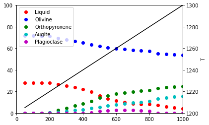

pMELTS
======

| Versions of MELTS implemented are:
| - MELTS v. 1.0.2 ➞ (rhyolite-MELTS, Gualda et al., 2012)
| - MELTS v. 1.1.0 ➞ (rhyolite-MELTS + new CO2, works at the ternary
  minimum)
| - MELTS v. 1.2.0 ➞ (rhyolite-MELTS + new H2O + new CO2)
| - pMELTS v. 5.6.1

Initialize tools and packages that are required to execute this notebook.
-------------------------------------------------------------------------

.. code:: ipython3

    from thermoengine import equilibrate
    import matplotlib.pyplot as plt
    import numpy as np
    %matplotlib inline

Create a pMELTS v 5.6.1 instance.
---------------------------------

Rhyolite-MELTS version 1.0.2 is the default model.

.. code:: ipython3

    melts = equilibrate.MELTSmodel(version="5.6.1")

Optional: Generate some information about the implemented model.
~~~~~~~~~~~~~~~~~~~~~~~~~~~~~~~~~~~~~~~~~~~~~~~~~~~~~~~~~~~~~~~~

.. code:: ipython3

    oxides = melts.get_oxide_names()
    phases = melts.get_phase_names()
    #print (oxides)
    #print (phases)

Required: Input initial composition of the system (liquid), in wt% or grams of oxides.
--------------------------------------------------------------------------------------

Early Bishop Tuff average melt inlusion composition

.. code:: ipython3

    feasible = melts.set_bulk_composition({'SiO2':  45.47, 
                                           'TiO2':   0.11, 
                                           'Al2O3':  4.0, 
                                           'Fe2O3':  0.585,
                                           'Cr2O3':  0.0, 
                                           'FeO':    6.696, 
                                           'MnO':    0.0,
                                           'MgO':   38.53, 
                                           'NiO':    0.0, 
                                           'CoO':    0.0,
                                           'CaO':    3.59, 
                                           'Na2O':   0.31, 
                                           'K2O':    0.0, 
                                           'P2O5':   0.0, 
                                           'H2O':    0.0})

Optional: Suppress phases that are not required in the simulation.
------------------------------------------------------------------

.. code:: ipython3

    b = melts.get_phase_inclusion_status()
    melts.set_phase_inclusion_status({'Actinolite':False, 'Aegirine':False, \
                                      'Aenigmatite':False, 'Akermanite':False, 'Andalusite':False, \
                                      'Anthophyllite':False, 'Apatite':False, 'Biotite':False, 'Chromite':False, \
                                      'Coesite':False, 'Corundum':False, 'Cristobalite':False, 'Cummingtonite':False, \
                                      'Fayalite':False, 'Forsterite':False, 'Gehlenite':False, 'Hematite':False, \
                                      'Hornblende':False, 'Ilmenite':False, 'Ilmenite ss':False, 'Kalsilite':False, \
                                      'Kalsilite ss':False, 'Kyanite':False, 'Leucite':False, 'Lime':False, \
                                      'Liquid Alloy':False, 'Magnetite':False, 'Melilite':False, 'Muscovite':False, \
                                      'Nepheline':False, 'Nepheline ss':False, 'OrthoOxide':False, 'Panunzite':False, \
                                      'Periclase':False, 'Perovskite':False, 'Phlogopite':False, 'Quartz':False, \
                                      'Rutile':False, 'Sanidine':False, 'Sillimanite':False, 'Solid Alloy':False, \
                                      'Sphene':False, 'Tridymite':False, 'Whitlockite':False})
    
    a = melts.get_phase_inclusion_status()
    for phase in b.keys():
        if b[phase] != a[phase]:
            print ("{0:<15s} Before: {1:<5s} After: {2:<5s}".format(phase, repr(b[phase]), repr(a[phase])))

.. parsed-literal::

    Actinolite      Before: True  After: False
    Aegirine        Before: True  After: False
    Aenigmatite     Before: True  After: False
    Akermanite      Before: True  After: False
    Andalusite      Before: True  After: False
    Anthophyllite   Before: True  After: False
    Apatite         Before: True  After: False
    Biotite         Before: True  After: False
    Chromite        Before: True  After: False
    Coesite         Before: True  After: False
    Corundum        Before: True  After: False
    Cristobalite    Before: True  After: False
    Cummingtonite   Before: True  After: False
    Fayalite        Before: True  After: False
    Forsterite      Before: True  After: False
    Gehlenite       Before: True  After: False
    Hematite        Before: True  After: False
    Hornblende      Before: True  After: False
    Ilmenite        Before: True  After: False
    Ilmenite ss     Before: True  After: False
    Kalsilite       Before: True  After: False
    Kalsilite ss    Before: True  After: False
    Kyanite         Before: True  After: False
    Leucite         Before: True  After: False
    Lime            Before: True  After: False
    Liquid Alloy    Before: True  After: False
    Magnetite       Before: True  After: False
    Melilite        Before: True  After: False
    Muscovite       Before: True  After: False
    Nepheline       Before: True  After: False
    Nepheline ss    Before: True  After: False
    OrthoOxide      Before: True  After: False
    Panunzite       Before: True  After: False
    Periclase       Before: True  After: False
    Perovskite      Before: True  After: False
    Phlogopite      Before: True  After: False
    Quartz          Before: True  After: False
    Rutile          Before: True  After: False
    Sanidine        Before: True  After: False
    Sillimanite     Before: True  After: False
    Solid Alloy     Before: True  After: False
    Sphene          Before: True  After: False
    Tridymite       Before: True  After: False
    Whitlockite     Before: True  After: False

Compute the equilibrium state at some specified T (°C) and P (MPa).
-------------------------------------------------------------------

Print status of the calculation.

.. code:: ipython3

    output = melts.equilibrate_tp(1300.0, 1000.0, initialize=True)
    (status, t, p, xmlout) = output[0]
    print (status, t, p)

.. parsed-literal::

    success, Optimal residual norm. 1300.0 1000.0

Summary output of equilibrium state …
~~~~~~~~~~~~~~~~~~~~~~~~~~~~~~~~~~~~~

.. code:: ipython3

    melts.output_summary(xmlout)

.. parsed-literal::

    T (°C)      1300.00
    P (MPa)     1000.00
    Augite           15.6279 (g)  Na0.05Ca0.67Fe''0.10Mg0.97Fe'''0.04Ti0.01Al0.32Si1.84O6     
    Olivine          53.9240 (g)  (Ca0.00Mg0.91Fe''0.09Mn0.00Co0.00Ni0.00)2SiO4               
    Spinel            1.1339 (g)  Fe''0.12Mg0.88Fe'''0.10Al1.89Cr0.00Ti0.00O4                 
    Liquid            4.0410 (g)  wt%:SiO2 48.94 TiO2  0.48 Al2O3 19.05 Fe2O3  1.96 Cr2O3  0.00 FeO  5.04 MnO  0.00 MgO
                                      11.73 NiO  0.00 CoO  0.00 CaO  8.39 Na2O  4.42 K2O  0.00 P2O5  0.00 H2O  0.00
    Orthopyroxene    24.5641 (g)  Na0.01Ca0.06Fe''0.15Mg1.67Fe'''0.02Ti0.00Al0.22Si1.88O6     

Output thermodynamic properties of any phase present in the system
~~~~~~~~~~~~~~~~~~~~~~~~~~~~~~~~~~~~~~~~~~~~~~~~~~~~~~~~~~~~~~~~~~

… or the sum of all phases in the system

.. code:: ipython3

    print ("{0:<20s} {1:13.6e} {2:<10s}".format('Entropy', melts.get_property_of_phase(xmlout,'System', 'Entropy'), \
                                                melts.get_units_of_property('Entropy')))

.. parsed-literal::

    Entropy               2.505416e+02 J/K       

Run the sequence of calculations along a T, P gradient:
-------------------------------------------------------

Output is sent to an Excel file and plotted in the notebook

.. code:: ipython3

    number_of_steps = 20
    t_increment_of_steps = -5.0
    p_increment_of_steps = -50.0
    
    plotPhases = ['Liquid', 'Olivine', 'Orthopyroxene', 'Augite', 'Plagioclase']
    # matplotlib colors b : blue, g : green, r : red, c : cyan, m : magenta, y : yellow, k : black, w : white.
    plotColors = [ 'ro', 'bo', 'go', 'co', 'mo']
    
    wb = melts.start_excel_workbook_with_sheet_name(sheetName="Summary")
    melts.update_excel_workbook(wb, xmlout)
    
    n = len(plotPhases)
    xPlot = np.zeros(number_of_steps)
    yPlot = np.zeros((n, number_of_steps))
    y2Plot = np.full(number_of_steps, t)
    xPlot[0] = p
    for i in range (0, n):
        yPlot[i][0] = melts.get_property_of_phase(xmlout, plotPhases[i])
    y2Plot[0] = t
    
    plt.ion()
    fig = plt.figure()
    ax = fig.add_subplot(111)
    ax.set_xlim([min(p, p+p_increment_of_steps*number_of_steps), max(p, p+p_increment_of_steps*number_of_steps)])
    ax.set_ylim([0., 100.])
    ax2 = ax.twinx()
    ax2.set_ylabel('T', color='k')
    ax2.set_ylim([t-100, t])
    
    graphs = []
    for i in range (0, n):
        graphs.append(ax.plot(xPlot, yPlot[i], plotColors[i]))
    graphs.append(ax2.plot(xPlot, y2Plot, 'k-'))
    handle = []
    for (graph,) in graphs:
        handle.append(graph)
    ax.legend(handle, plotPhases, loc='upper left')
    
    for i in range (1, number_of_steps):
        output = melts.equilibrate_tp(t+t_increment_of_steps, p+p_increment_of_steps)
        (status, t, p, xmlout) = output[0]
        print ("{0:<30s} {1:8.2f} {2:8.2f}".format(status, t, p))
        xPlot[i] = p
        for j in range (0, n):
            yPlot[j][i] = melts.get_property_of_phase(xmlout, plotPhases[j])
        y2Plot[i] = t
        j = 0
        for (graph,) in graphs:
            graph.set_xdata(xPlot)
            if j < n:
                graph.set_ydata(yPlot[j])
            else:
                graph.set_ydata(y2Plot)
            j = j + 1
        fig.canvas.draw()
        melts.update_excel_workbook(wb, xmlout)
    
    melts.write_excel_workbook(wb, "MELTSv102summary.xlsx")

.. parsed-literal::

    success, Optimal residual norm.  1295.00   950.00
    success, Optimal residual norm.  1290.00   900.00
    success, Optimal residual norm.  1285.00   850.00
    success, Minimal energy computed.  1280.00   800.00
    failure, Quadratic algorithm did not converge in 100 iterations (rNorm: 0.00123401).  1275.00   750.00
    failure, Quadratic algorithm did not converge in 100 iterations (rNorm: 0.00115807).  1270.00   700.00
    failure, Quadratic algorithm did not converge in 100 iterations (rNorm: 0.00193837).  1265.00   650.00
    success, Minimal energy computed.  1260.00   600.00
    failure, Quadratic algorithm did not converge in 100 iterations (rNorm: 0.000656849).  1255.00   550.00
    failure, Quadratic algorithm did not converge in 100 iterations (rNorm: 0.000421736).  1250.00   500.00
    success, Minimal energy computed.  1245.00   450.00
    success, Optimal residual norm.  1240.00   400.00
    success, Optimal residual norm.  1235.00   350.00
    success, Optimal residual norm.  1230.00   300.00
    success, Optimal residual norm.  1225.00   250.00
    success, Optimal residual norm.  1220.00   200.00
    success, Optimal residual norm.  1215.00   150.00
    success, Optimal residual norm.  1210.00   100.00
    success, Optimal residual norm.  1205.00    50.00

